# Activity Diagrams - IT Ticketing Support

Berikut adalah kumpulan Activity Diagram untuk sistem IT Ticketing Support, mencakup berbagai modul seperti Auth, Pembuatan Tiket (AHP), Manajemen Tiket, Operasional, dan Admin.

## 1. Modul Akses & Keamanan (Auth)

### Activity Diagram: Logout
*Proses menghapus session dan redirect ke halaman login.*

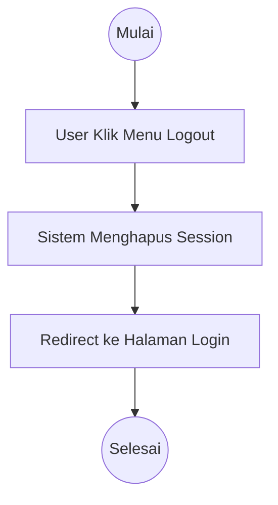

## 2. Modul Pembuatan Tiket (Core Feature)

### Activity Diagram: Create Ticket (Standard/Manual)
*Flow user membuat tiket biasa dengan memilih prioritas secara langsung.*

```mermaid
graph TD
    Start((Mulai)) --> UserAccessCreate[User Akses Menu Buat Tiket]
    UserAccessCreate --> ShowForm[Sistem Menampilkan Form Tiket]
    ShowForm --> UserFillForm[User Mengisi Judul, Deskripsi, Kategori & Lokasi]
    UserFillForm --> UserSelectPriority[User Memilih Prioritas Manual (Low/Medium/High)]
    UserSelectPriority --> UserSubmit[User Klik Submit]
    UserSubmit --> ValidateData{Validasi Data?}
    ValidateData -->|Tidak Valid| ShowError[Tampilkan Error]
    ShowError --> UserFillForm
    ValidateData -->|Valid| SaveTicket[Sistem Menyimpan Tiket (Status: Open)]
    SaveTicket --> NotifyAdmin[Sistem Mengirim Notifikasi ke Admin]
    NotifyAdmin --> RedirectList[Redirect ke Halaman Tiket Saya]
    RedirectList --> End((Selesai))
```

### Activity Diagram: Create Ticket dengan Analisis AHP
*Flow user mengisi kriteria, sistem menghitung bobot, memberikan rekomendasi, dan menyimpan.*

```mermaid
graph TD
    Start((Mulai)) --> UserAccessAHP[User Akses Menu Buat Tiket AHP]
    UserAccessAHP --> ShowAHPForm[Sistem Menampilkan Form Kriteria AHP]
    ShowAHPForm --> UserInputData[User Mengisi Data Tiket & Kriteria Penilaian]
    UserInputData --> UserClickCalc[User Klik Hitung Prioritas]
    UserClickCalc --> SystemCalcWeight[Sistem Menghitung Bobot dengan AHP]
    SystemCalcWeight --> ShowRecommendation[Sistem Menampilkan Rekomendasi Prioritas (Score)]
    ShowRecommendation --> UserConfirm{User Setuju?}
    UserConfirm -->|Tidak| UserAdjust[User Menyesuaikan Manual]
    UserAdjust --> SaveTicket
    UserConfirm -->|Ya| SaveTicket[Sistem Menyimpan Tiket dengan Prioritas Terhitung]
    SaveTicket --> NotifyAdmin[Sistem Mengirim Notifikasi]
    NotifyAdmin --> RedirectList[Redirect ke Dashboard]
    RedirectList --> End((Selesai))
```

## 3. Modul Manajemen Tiket (User)

### Activity Diagram: Tracking Status Tiket

```mermaid
graph TD
    Start((Mulai)) --> UserViewList[User Melihat Daftar Tiket]
    UserViewList --> UserSelectTicket[User Memilih Tiket]
    UserSelectTicket --> SystemShowDetail[Sistem Menampilkan Detail Tiket]
    SystemShowDetail --> ViewHistory[User Melihat History Status (Trail)]
    ViewHistory --> End((Selesai))
```

### Activity Diagram: Memberikan Komentar & Balasan

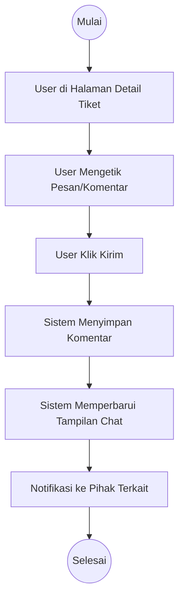

### Activity Diagram: Upload Bukti/Lampiran Tambahan

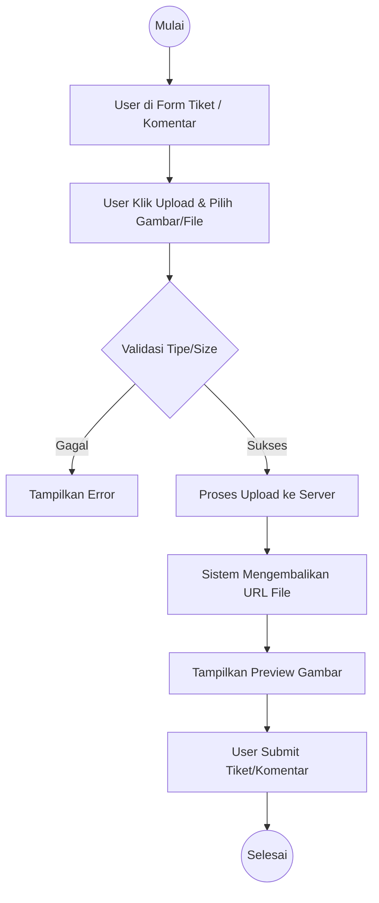

## 4. Modul Operasional IT Support (Proses Kerja)

### Activity Diagram: Claim Tiket (Self-Assignment)

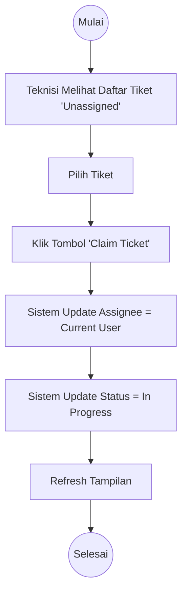

### Activity Diagram: Update Progress Tiket

```mermaid
graph TD
    Start((Mulai)) --> TechInDetail[Teknisi di Detail Tiket]
    TechInDetail --> ClickUpdateStatus[Klik Update Status]
    ClickUpdateStatus --> ChooseStatus[Pilih Status (In Progress -> Resolved)]
    ChooseStatus --> AddNote[Isi Catatan Pengerjaan (Opsional)]
    AddNote --> SaveUpdate[Simpan Perubahan]
    SaveUpdate --> SystemLog[Sistem Mencatat Log Aktivitas]
    SystemLog --> NotifyUser[Notifikasi ke Pembuat Tiket]
    NotifyUser --> End((Selesai))
```

### Activity Diagram: Penanganan Tiket Prioritas Tinggi

```mermaid
graph TD
    Start((Mulai)) --> SystemDetectHigh[Sistem Mendeteksi Tiket High/Critical]
    SystemDetectHigh --> SendUrgentNotif[Kirim Notifikasi Urgensi (WA/Email)]
    SendUrgentNotif --> TechReceive[Teknisi Menerima Alert]
    TechReceive --> TechPrioritize[Teknisi Segera Claim & Kerjakan]
    TechPrioritize --> UpdateFrequent[Update Progress Berkala]
    UpdateFrequent --> Resolve[Resolve Tiket]
    Resolve --> End((Selesai))
```

## 5. Modul Manajemen & Supervisi (Manager/Admin)

### Activity Diagram: Assignment Tiket (Pendelegasian)

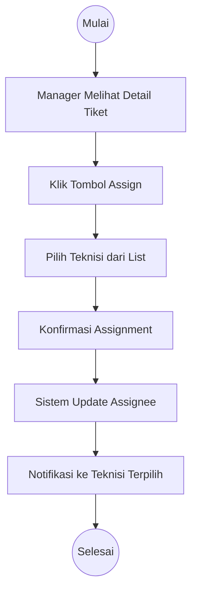

### Activity Diagram: Validasi & Closing Tiket

```mermaid
graph TD
    Start((Mulai)) --> TechResolve[Teknisi set Status Check/Resolved]
    TechResolve --> ManagerCheck[Manager Review Hasil Pekerjaan]
    ManagerCheck --> IsValid{Sesuai/Valid?}
    IsValid -->|Tidak| ReopenTicket[Kembalikan ke In Progress (Reopen)]
    ReopenTicket --> NotifyTechReopen[Notifikasi Revisi ke Teknisi]
    IsValid -->|Ya| CloseTicket[Set Status = Closed]
    CloseTicket --> NotifyUserClosed[Notifikasi ke User (Tiket Ditutup)]
    NotifyUserClosed --> End((Selesai))
```

### Activity Diagram: Monitoring Dashboard

```mermaid
graph TD
    Start((Mulai)) --> AdminAccessDash[Akses Halaman Dashboard]
    AdminAccessDash --> SystemFetchData[Sistem Request Data Statistik]
    SystemFetchData --> DisplayCharts[Tampilkan Grafik (Pie/Bar Chart)]
    DisplayCharts --> DisplayKPI[Tampilkan KPI & Tiket Kritis]
    DisplayKPI --> AdminFilter[Admin Filter (Periode/Kategori)]
    AdminFilter --> UpdateCharts[Update Tampilan Grafik]
    UpdateCharts --> End((Selesai))
```

## 6. Modul Manajemen Data Sampah (Spam/Trash)

### Activity Diagram: Pembatalan Tiket (Soft Delete)

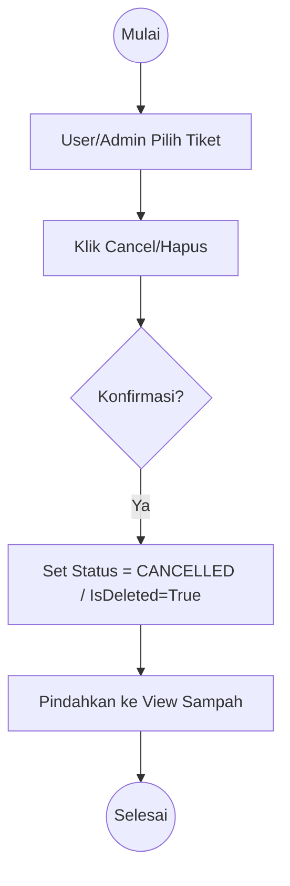

### Activity Diagram: Restore Tiket

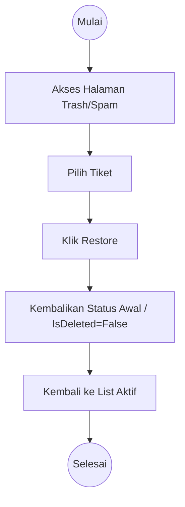

### Activity Diagram: Penghapusan Permanen

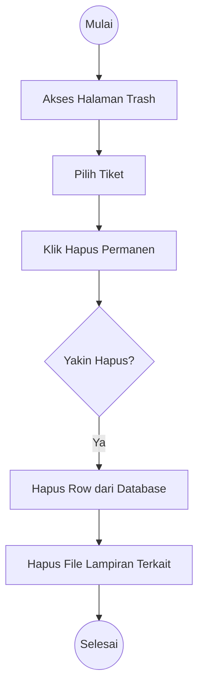

## 7. Modul Knowledge Base (Artikel Solusi)

### Activity Diagram: Membuat Artikel Solusi (KB)

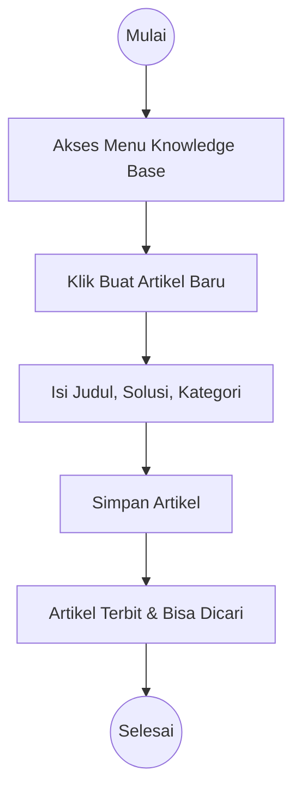

### Activity Diagram: Pencarian Solusi Mandiri

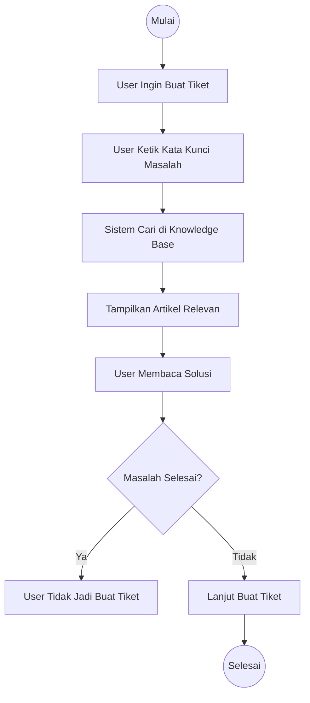

## 8. Modul Administrasi Sistem (Super Admin)

### Activity Diagram: Kelola User (CRUD)

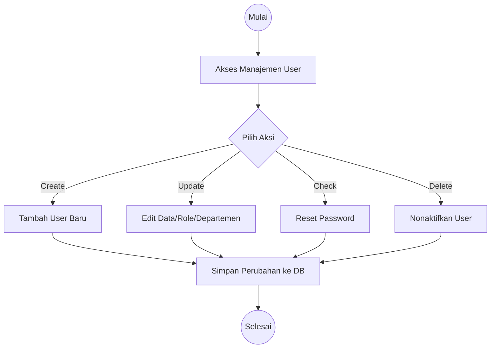

### Activity Diagram: Konfigurasi Kriteria AHP

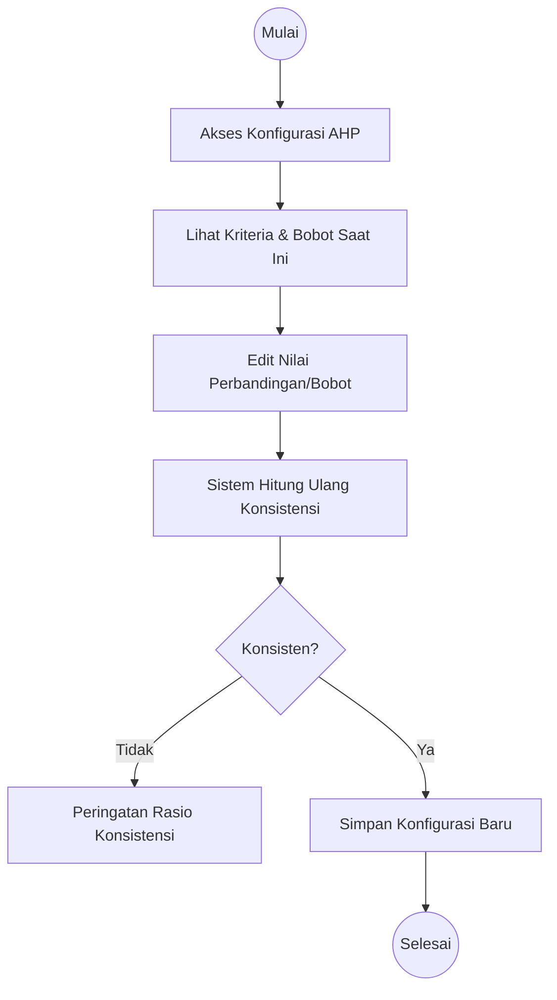

## 9. Modul Notifikasi

### Activity Diagram: Sistem Notifikasi WhatsApp

```mermaid
graph TD
    Start((Mulai)) --> NewTicketEvent[Event: Tiket Baru Dibuat]
    NewTicketEvent --> SystemPrepareData[Siapkan Data (ID, Judul, Pelapor)]
    SystemPrepareData --> CallWAApi[Panggil API WhatsApp Gateway]
    CallWAApi --> SendMessage[Kirim Pesan ke Nomor Admin]
    SendMessage --> AdminReceive[Admin Terima WA]
    AdminReceive --> End((Selesai))
```
