# Activity Diagrams - IT Ticketing Support

Dokumen ini menyajikan Activity Diagram untuk sistem IT Ticketing Support yang selaras secara presisi (1:1) dengan 14 use case pada Use Case Diagram. Setiap diagram memisahkan tanggung jawab menggunakan swimlane PlantUML antara Aktor dan Sistem.

---

## 1. Login
*Aktivitas untuk memvalidasi kredensial pengguna dan mengarahkan ke dashboard yang sesuai.*

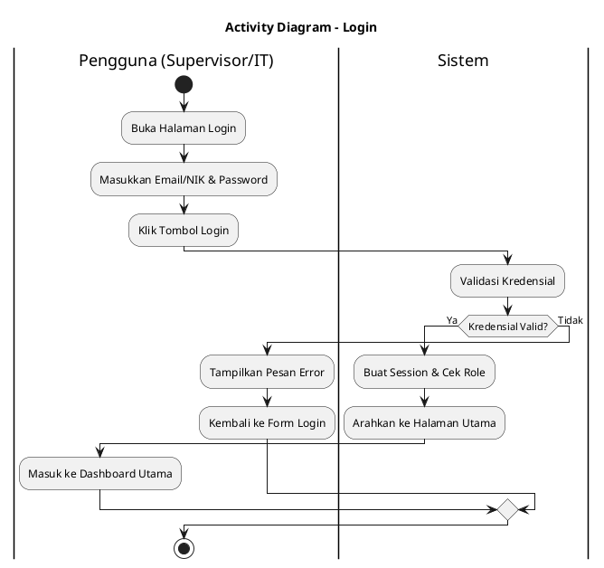

---

## 2. Membuat Tiket
*Aktivitas untuk mengajukan tiket permasalahan baru lengkap dengan kuesioner prioritas AHP.*

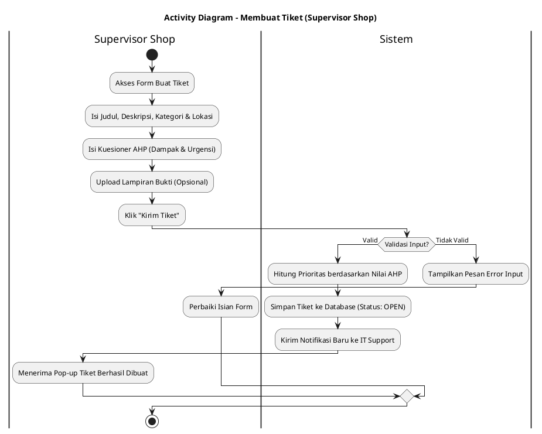

---

## 3. Melihat Status Tiket
*Aktivitas bagi pembuat tiket untuk memantau perkembangan dan riwayat status tiketnya.*

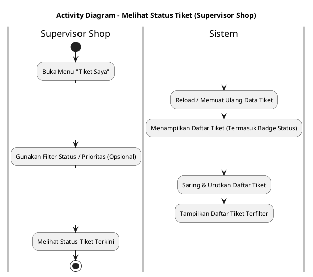

---

## 4. Diskusi & Chat
*Aktivitas komunikasi/tanya jawab interaktif antara pelapor dan teknisi di halaman detail tiket.*

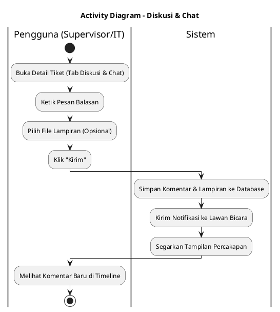

---

## 5. Membaca Knowledge Base
*Aktivitas untuk mencari dan membaca tutorial solusi mandiri guna menyelesaikan masalah.*

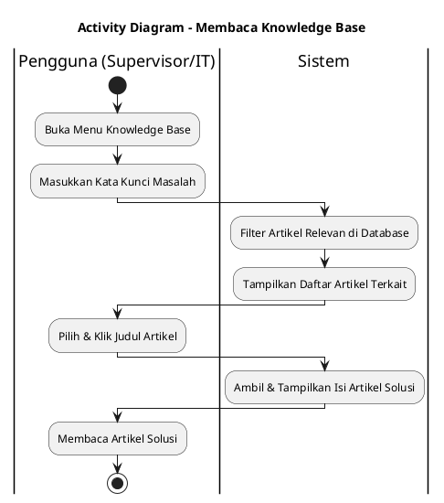

---

## 6. Menerima Notifikasi
*Aktivitas penerimaan notifikasi real-time saat terjadi aktivitas tiket.*

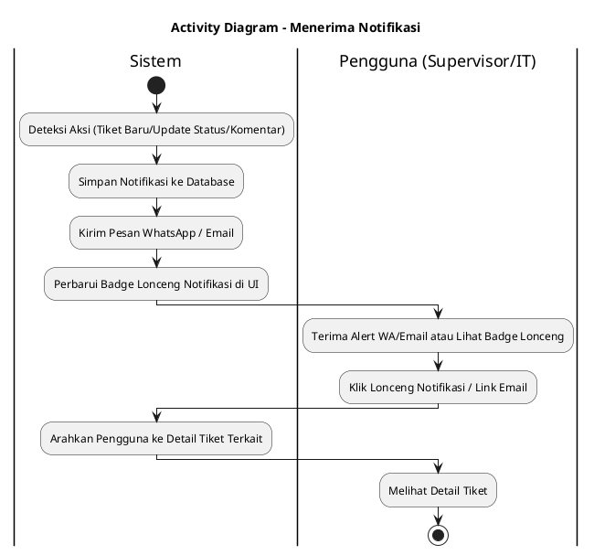

---

## 7. Mengambil Tiket
*Aktivitas penugasan mandiri (Claim Ticket) oleh tim IT Support pada tiket-tiket baru.*

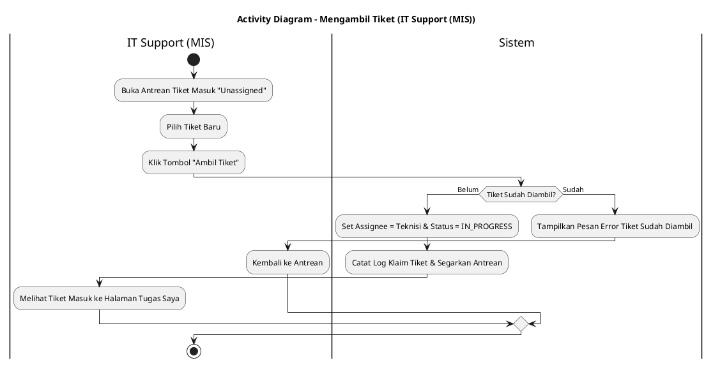

---

## 8. Melihat Tiket Tugas Saya
*Aktivitas untuk memantau daftar tiket yang sedang ditugaskan kepada teknisi (terurut berdasarkan AHP).*

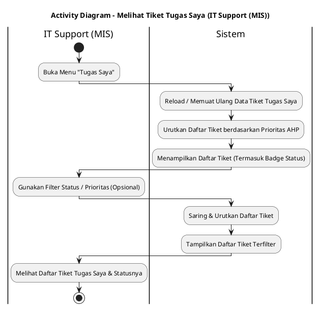

---

## 9. Mengubah Status Tiket
*Aktivitas memperbarui status progres pengerjaan tiket oleh teknisi.*

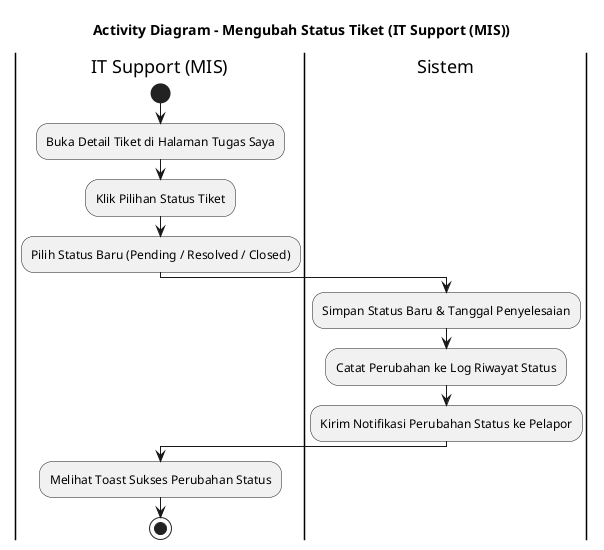

---

## 10. Membuat Tutorial
*Aktivitas mempublikasikan solusi penanganan tiket menjadi artikel baru di Knowledge Base.*

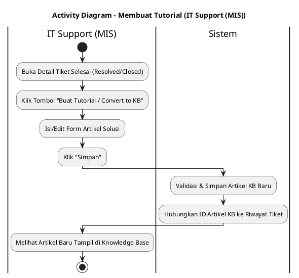

---

## 11. Konfigurasi AHP
*Aktivitas untuk memperbarui bobot kriteria AHP untuk perhitungan prioritas otomatis.*

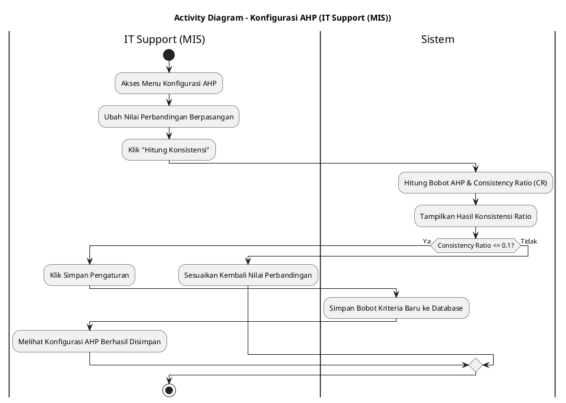

---

## 12. Mengembalikan Tiket
*Aktivitas mengembalikan tiket yang tidak sanggup dikerjakan kembali ke antrean unassigned atau mengalihkannya.*

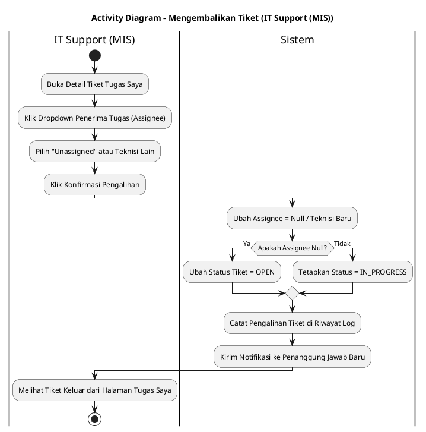

---

## 13. Melihat Laporan Analitik
*Aktivitas menganalisis kinerja operasional TI, rata-rata resolusi SLA, dan ekspor laporan.*

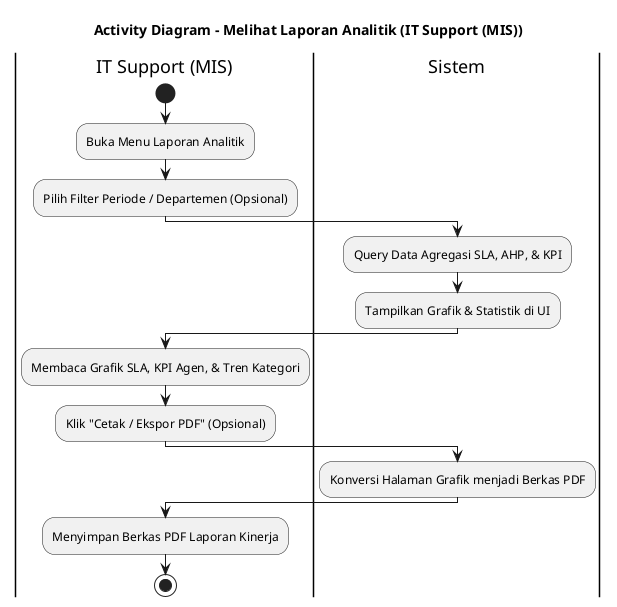

---

## 14. Manajemen User
*Aktivitas pengelolaan akun pengguna sistem (tambah/edit/hapus/reset password).*

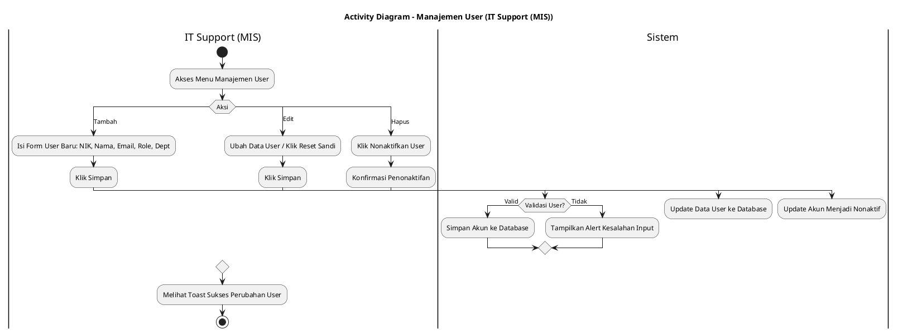
