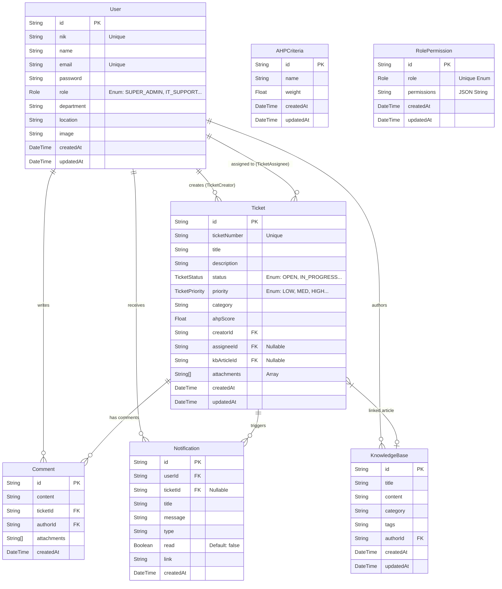

# Entity Relationship Diagram (ERD)

Diagram ini merepresentasikan struktur database aktual berdasarkan `schema.prisma`.

## ERD (Mermaid Format)

## Enum Types

### Role
*   SUPER_ADMIN
*   IT_SUPPORT
*   MANAGER
*   SUPERVISOR
*   FINANCE
*   STAFF
*   SECURITY

### TicketStatus
*   OPEN
*   IN_PROGRESS
*   PENDING
*   RESOLVED
*   CLOSED
*   CANCELLED

### TicketPriority
*   LOW
*   MEDIUM
*   HIGH
*   CRITICAL
