# Full Sequence Diagrams (Mermaid Format)

Dokumen ini berisi **Sequence Diagram** yang direvisi ke format **Mermaid** agar mudah dirender dan dibaca. Kontennya tetap sesuai dengan logika sistem aktual (API & Database).

**Poin Penting:**
1. **Perhitungan AHP**: Terjadi otomatis di Server (`POST /api/tickets/create`).
2. **Assignment**: Menggunakan menu "Belum Ditugaskan" (akses Admin/IT Support).
3. **Update Status**: Backend otomatis mencatat Log Komentar sistem.
4. **Notifikasi**: Berjalan secara *asynchronous* (paralel).

---

## 1. Modul Akses & Keamanan

### A. Sequence Diagram: Logout
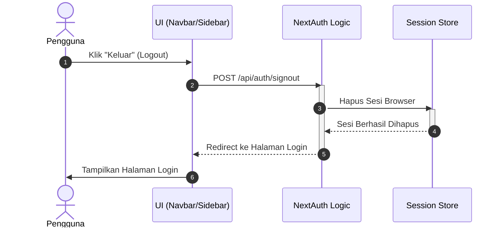

---

## 2. Modul Pembuatan Tiket (Core)

### B. Sequence Diagram: Create Ticket (Standar)
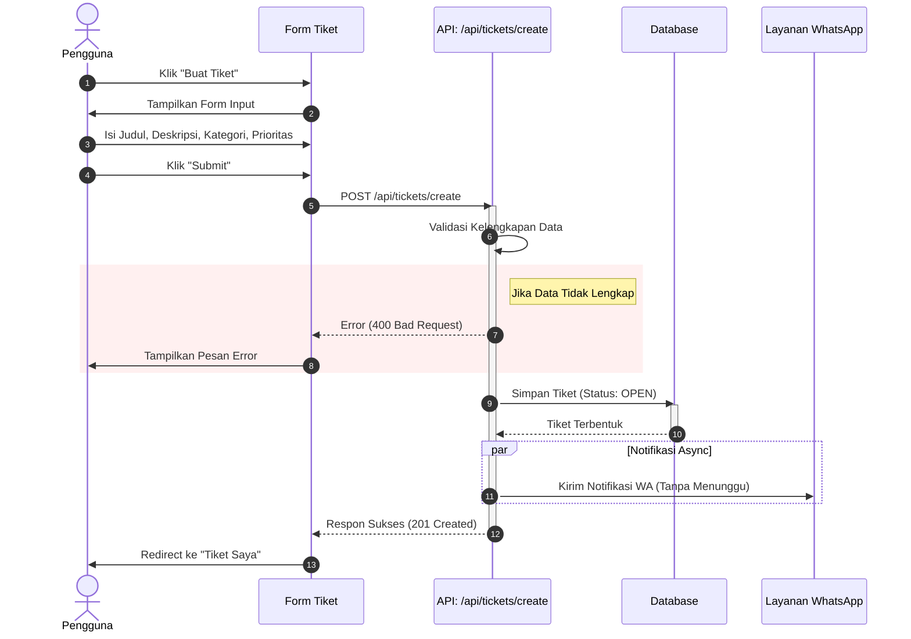

### C. Sequence Diagram: Create Ticket dengan AHP
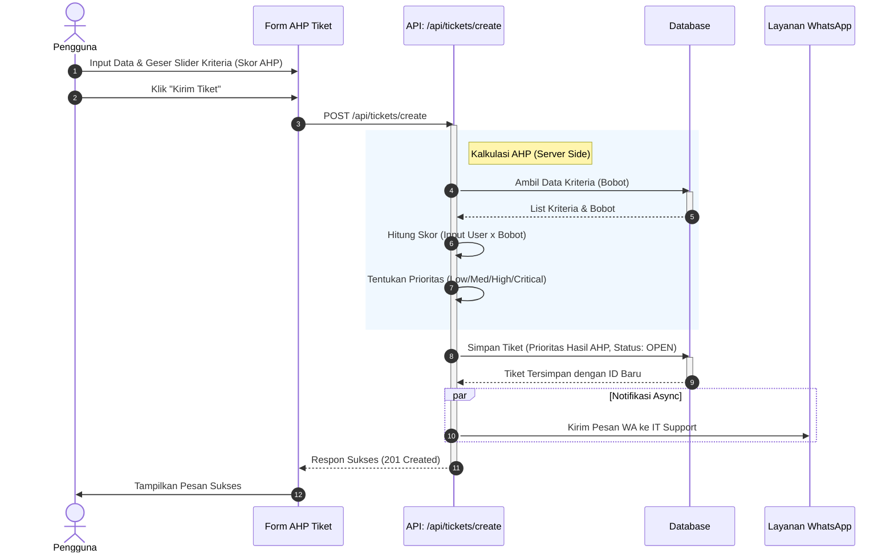

---

## 3. Modul Manajemen Tiket (User)

### D. Sequence Diagram: Tracking Status & History
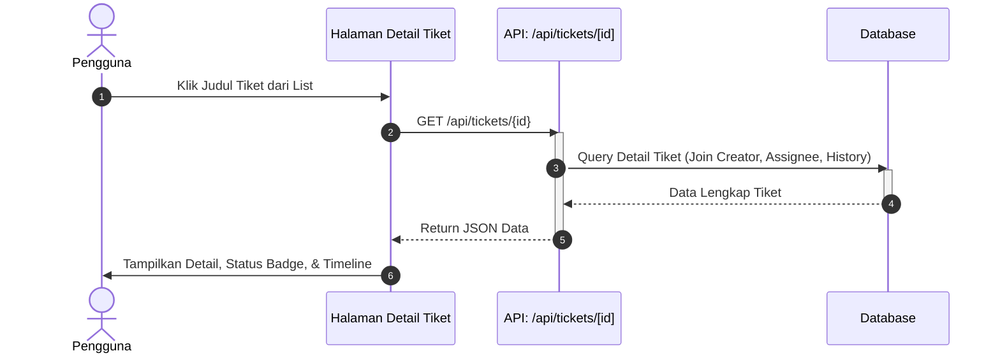

### E. Sequence Diagram: Komentar & Balasan
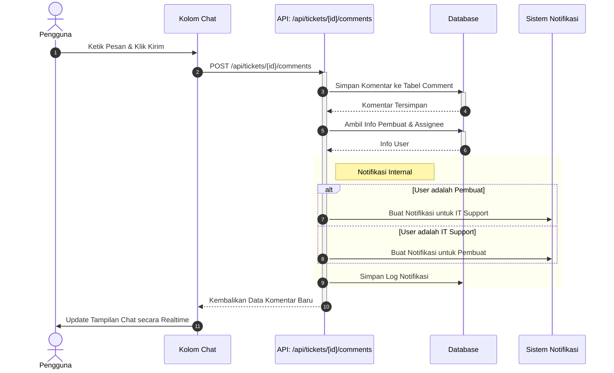

### F. Sequence Diagram: Upload Bukti
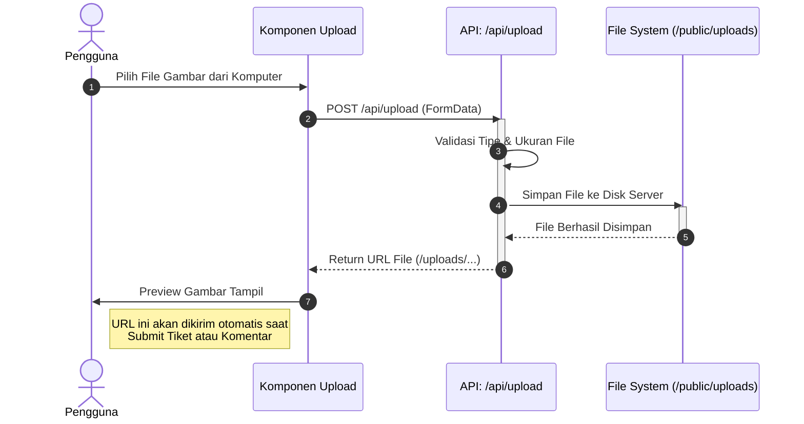

---

## 4. Modul Operasional IT Support

### G. Sequence Diagram: Claim Tiket (Ambil Tiket)
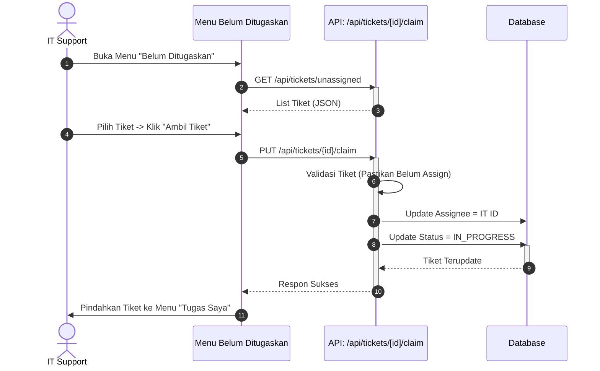

### H. Sequence Diagram: Update Progress
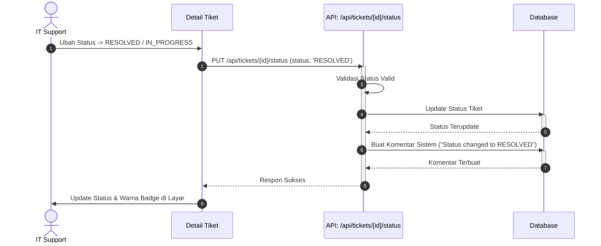

### I. Sequence Diagram: Notifikasi & Respon (Flow IT Support)
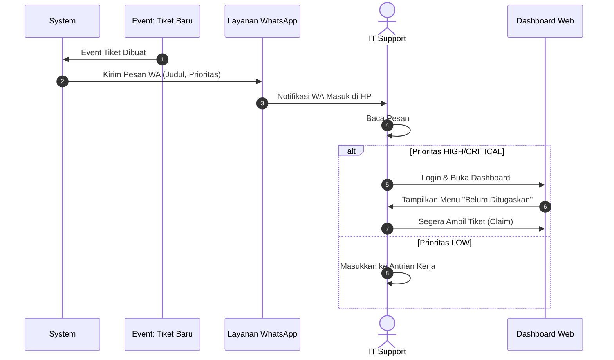

---

## 5. Modul Manajemen (Manager)

### J. Sequence Diagram: Assignment (Pendelegasian Manual)
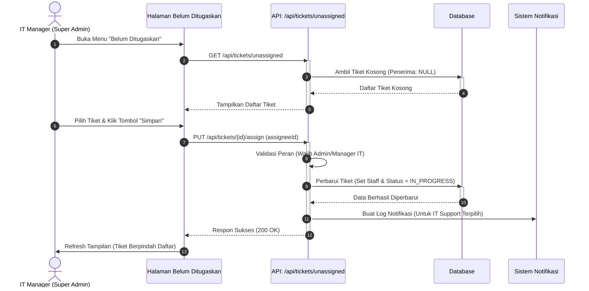

### K. Sequence Diagram: Validasi & Closing
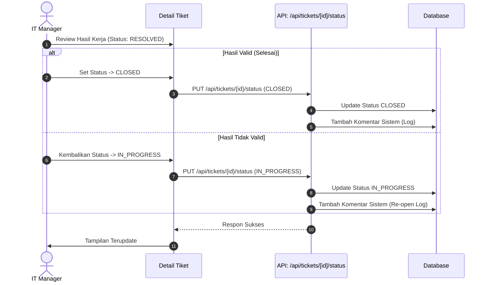

### L. Sequence Diagram: Monitoring Dashboard
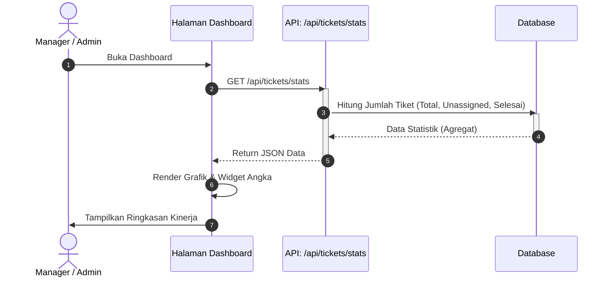

---

## 6. Modul Manajemen Data Sampah (Spam)

### M. Sequence Diagram: Pembatalan Tiket (Soft Delete)
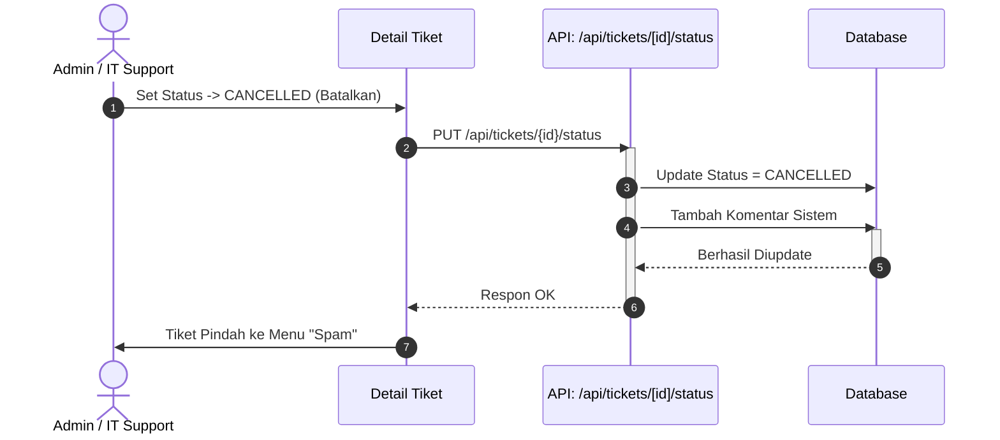

### N. Sequence Diagram: Restore (Pulihkan Data)
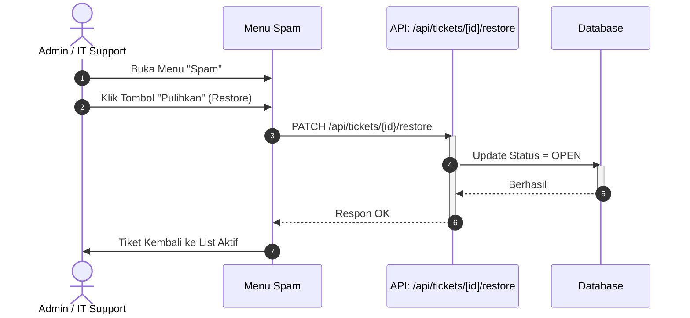

### O. Sequence Diagram: Hapus Permanen (Hard Delete)
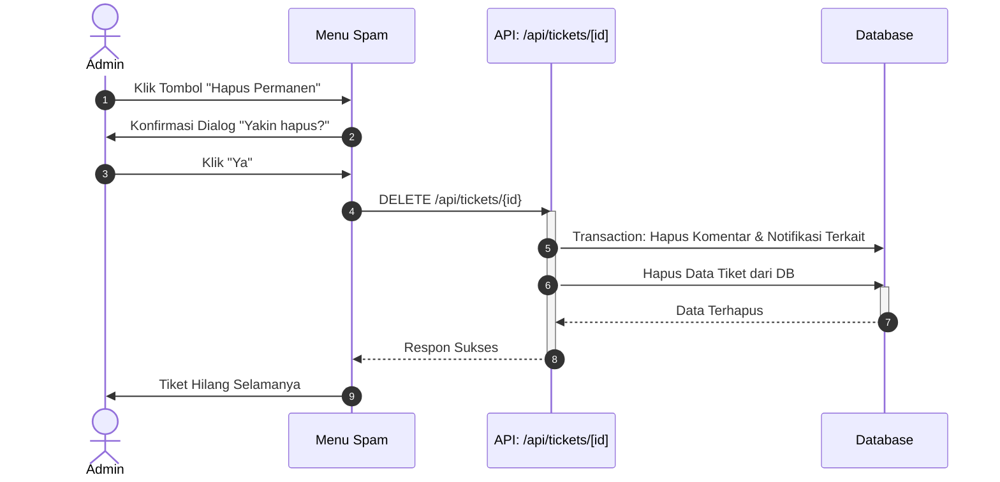

---

## 7. Modul Knowledge Base (KB)

### P. Sequence Diagram: Membuat Artikel Solusi
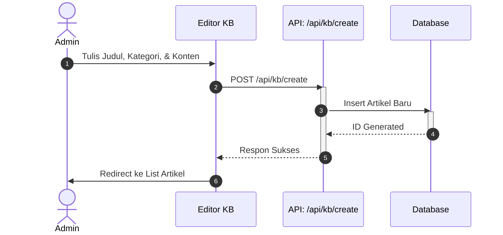

### Q. Sequence Diagram: Pencarian Solusi Mandiri
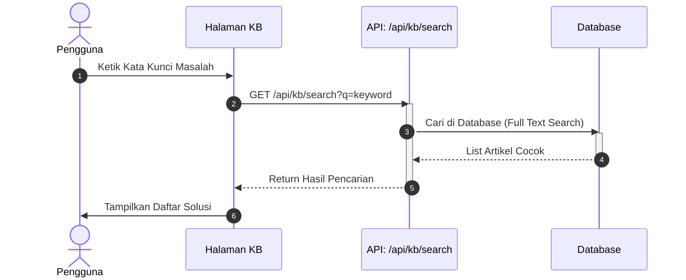

---

## 8. Modul Administrasi

### R. Sequence Diagram: Kelola User
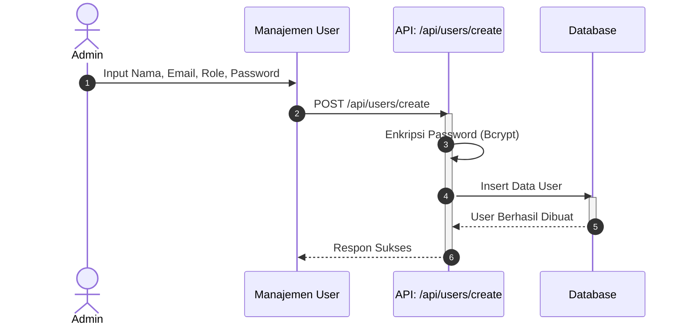

### S. Sequence Diagram: Konfigurasi Kriteria AHP
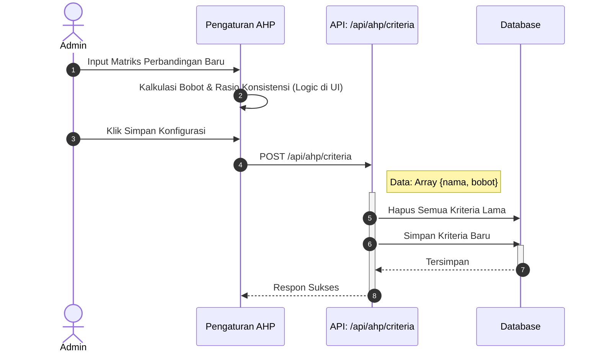

---

## 9. Modul Notifikasi

### T. Sequence Diagram: Notifikasi WhatsApp System
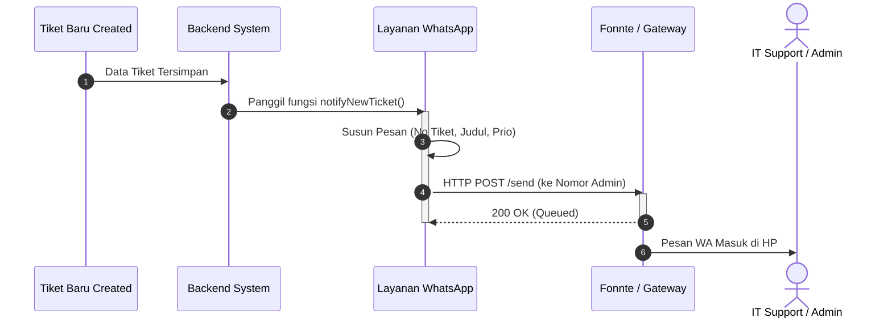
