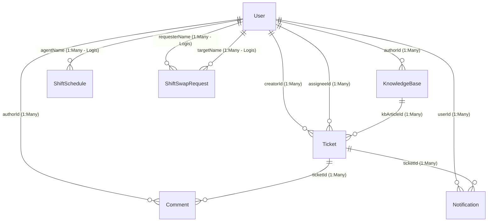

# Logical Record Structure (LRS) — IT Ticketing Support System

Dokumen ini berisi file XML draw.io untuk merepresentasikan **Logical Record Structure (LRS)** sistem **IT Ticketing Support**. 

LRS adalah representasi struktur data logis yang dihasilkan dari transformasi ERD. Berbeda dengan ERD, pada diagram LRS:
1. **Tidak ada relasi diamond (belah ketupat)**. Hubungan antar tabel digambarkan secara langsung.
2. Setiap entitas digambarkan sebagai **kotak tabel lengkap dengan seluruh field-nya**.
3. **Primary Key (PK)** berada di baris atas dan diberi tanda `[PK]`, diikuti oleh atribut biasa, dan **Foreign Key (FK)** berada di bagian bawah dengan tanda `[FK]`.
4. Garis penghubung adalah **garis panah langsung yang berarah dari tabel induk (Parent/sisi 1) ke tabel anak (Child/sisi Many)** yang menampung Foreign Key.
5. Setiap garis panah diberi **label field penghubung (Foreign Key)** yang bersangkutan.

---

## Cara Import ke draw.io

1. Buka **draw.io** (https://app.diagrams.net) atau aplikasi draw.io Desktop.
2. Buat diagram baru atau buka diagram kosong.
3. Pada menu atas, pilih **Extras → Edit Diagram** (atau **File → Import**).
4. **Hapus** semua teks XML bawaan yang ada di kotak input.
5. **Salin dan tempel (copy-paste)** seluruh isi kode XML di bawah ini.
6. Klik **OK** (atau **Apply**). Diagram LRS yang rapi dan siap pakai akan langsung terbentuk secara otomatis!

---

## XML draw.io (Salin Semua Kode di Bawah Ini)

```xml
<mxGraphModel dx="1422" dy="762" grid="1" gridSize="10" guides="1" tooltips="1" connect="1" arrows="1" fold="1" page="1" pageScale="1" pageWidth="1654" pageHeight="1169" math="0" shadow="0">
  <root>
    <mxCell id="0" />
    <mxCell id="1" parent="0" />

    <!-- ===== JUDUL DIAGRAM ===== -->
    <mxCell id="title" value="Logical Record Structure (LRS) — IT Ticketing Support System" style="text;html=1;strokeColor=none;fillColor=none;align=center;verticalAlign=middle;whiteSpace=wrap;rounded=0;fontSize=18;fontStyle=1;fontColor=#1a1a2e;" vertex="1" parent="1">
      <mxGeometry x="400" y="20" width="800" height="40" as="geometry" />
    </mxCell>

    <!-- ============================================================ -->
    <!-- TABEL / ENTITAS LRS -->
    <!-- ============================================================ -->

    <!-- User Table (Core - Blue) -->
    <mxCell id="ent_user" value="&lt;b&gt;User (Pengguna)&lt;/b&gt;&lt;hr&gt;&lt;b&gt;id&lt;/b&gt; [PK]&lt;br&gt;&lt;b&gt;nik&lt;/b&gt; (Unique)&lt;br&gt;name&lt;br&gt;&lt;b&gt;email&lt;/b&gt; (Unique)&lt;br&gt;password&lt;br&gt;role (Enum)&lt;br&gt;department&lt;br&gt;location&lt;br&gt;image&lt;br&gt;failedLoginAttempts&lt;br&gt;lockedUntil&lt;br&gt;createdAt&lt;br&gt;updatedAt" style="rounded=0;whiteSpace=wrap;html=1;fillColor=#e1f5fe;strokeColor=#0288d1;fontColor=#01579b;align=left;verticalAlign=top;spacingLeft=10;spacingTop=5;fontSize=11;" vertex="1" parent="1">
      <mxGeometry x="50" y="270" width="180" height="240" as="geometry" />
    </mxCell>

    <!-- Ticket Table (Core - Blue) -->
    <mxCell id="ent_ticket" value="&lt;b&gt;Ticket (Tiket)&lt;/b&gt;&lt;hr&gt;&lt;b&gt;id&lt;/b&gt; [PK]&lt;br&gt;&lt;b&gt;ticketNumber&lt;/b&gt; (Unique)&lt;br&gt;title&lt;br&gt;description&lt;br&gt;status (Enum)&lt;br&gt;priority (Enum)&lt;br&gt;category&lt;br&gt;ahpScore&lt;br&gt;attachments (Array)&lt;br&gt;createdAt&lt;br&gt;updatedAt&lt;br&gt;&lt;i&gt;creatorId&lt;/i&gt; [FK]&lt;br&gt;&lt;i&gt;assigneeId&lt;/i&gt; [FK, Nullable]&lt;br&gt;&lt;i&gt;kbArticleId&lt;/i&gt; [FK, Nullable]" style="rounded=0;whiteSpace=wrap;html=1;fillColor=#e1f5fe;strokeColor=#0288d1;fontColor=#01579b;align=left;verticalAlign=top;spacingLeft=10;spacingTop=5;fontSize=11;" vertex="1" parent="1">
      <mxGeometry x="500" y="250" width="220" height="280" as="geometry" />
    </mxCell>

    <!-- KnowledgeBase Table (Supporting - Green) -->
    <mxCell id="ent_kb" value="&lt;b&gt;KnowledgeBase (Artikel)&lt;/b&gt;&lt;hr&gt;&lt;b&gt;id&lt;/b&gt; [PK]&lt;br&gt;title&lt;br&gt;content&lt;br&gt;category&lt;br&gt;tags&lt;br&gt;createdAt&lt;br&gt;updatedAt&lt;br&gt;&lt;i&gt;authorId&lt;/i&gt; [FK]" style="rounded=0;whiteSpace=wrap;html=1;fillColor=#e8f5e9;strokeColor=#2e7d32;fontColor=#1b5e20;align=left;verticalAlign=top;spacingLeft=10;spacingTop=5;fontSize=11;" vertex="1" parent="1">
      <mxGeometry x="500" y="30" width="220" height="160" as="geometry" />
    </mxCell>

    <!-- Comment Table (Supporting - Green) -->
    <mxCell id="ent_comment" value="&lt;b&gt;Comment (Komentar)&lt;/b&gt;&lt;hr&gt;&lt;b&gt;id&lt;/b&gt; [PK]&lt;br&gt;content&lt;br&gt;attachments (Array)&lt;br&gt;createdAt&lt;br&gt;&lt;i&gt;ticketId&lt;/i&gt; [FK]&lt;br&gt;&lt;i&gt;authorId&lt;/i&gt; [FK]" style="rounded=0;whiteSpace=wrap;html=1;fillColor=#e8f5e9;strokeColor=#2e7d32;fontColor=#1b5e20;align=left;verticalAlign=top;spacingLeft=10;spacingTop=5;fontSize=11;" vertex="1" parent="1">
      <mxGeometry x="500" y="600" width="220" height="140" as="geometry" />
    </mxCell>

    <!-- Notification Table (Supporting - Green) -->
    <mxCell id="ent_notif" value="&lt;b&gt;Notification (Notifikasi)&lt;/b&gt;&lt;hr&gt;&lt;b&gt;id&lt;/b&gt; [PK]&lt;br&gt;title&lt;br&gt;message&lt;br&gt;type&lt;br&gt;read (Boolean)&lt;br&gt;link&lt;br&gt;createdAt&lt;br&gt;&lt;i&gt;userId&lt;/i&gt; [FK]&lt;br&gt;&lt;i&gt;ticketId&lt;/i&gt; [FK, Nullable]" style="rounded=0;whiteSpace=wrap;html=1;fillColor=#e8f5e9;strokeColor=#2e7d32;fontColor=#1b5e20;align=left;verticalAlign=top;spacingLeft=10;spacingTop=5;fontSize=11;" vertex="1" parent="1">
      <mxGeometry x="900" y="290" width="220" height="200" as="geometry" />
    </mxCell>

    <!-- ShiftSchedule Table (Shift & AHP - Purple) -->
    <mxCell id="ent_schedule" value="&lt;b&gt;ShiftSchedule (Jadwal Shift)&lt;/b&gt;&lt;hr&gt;&lt;b&gt;id&lt;/b&gt; [PK]&lt;br&gt;date&lt;br&gt;shift&lt;br&gt;&lt;i&gt;agentName&lt;/i&gt; [FK Logis]&lt;br&gt;createdAt&lt;br&gt;updatedAt" style="rounded=0;whiteSpace=wrap;html=1;fillColor=#f3e5f5;strokeColor=#7b1fa2;fontColor=#4a148c;align=left;verticalAlign=top;spacingLeft=10;spacingTop=5;fontSize=11;" vertex="1" parent="1">
      <mxGeometry x="50" y="600" width="180" height="140" as="geometry" />
    </mxCell>

    <!-- ShiftSwapRequest Table (Shift & AHP - Purple) -->
    <mxCell id="ent_swap" value="&lt;b&gt;ShiftSwapRequest (Tukar Shift)&lt;/b&gt;&lt;hr&gt;&lt;b&gt;id&lt;/b&gt; [PK]&lt;br&gt;&lt;i&gt;requesterName&lt;/i&gt; [FK Logis]&lt;br&gt;requesterShift&lt;br&gt;requesterDate&lt;br&gt;&lt;i&gt;targetName&lt;/i&gt; [FK Logis]&lt;br&gt;targetShift&lt;br&gt;targetDate&lt;br&gt;reason&lt;br&gt;status&lt;br&gt;approvedBy&lt;br&gt;approvedAt&lt;br&gt;createdAt&lt;br&gt;updatedAt" style="rounded=0;whiteSpace=wrap;html=1;fillColor=#f3e5f5;strokeColor=#7b1fa2;fontColor=#4a148c;align=left;verticalAlign=top;spacingLeft=10;spacingTop=5;fontSize=11;" vertex="1" parent="1">
      <mxGeometry x="50" y="800" width="200" height="250" as="geometry" />
    </mxCell>

    <!-- AHPCriteria Table (Shift & AHP - Purple) -->
    <mxCell id="ent_ahp" value="&lt;b&gt;AHPCriteria (Kriteria AHP)&lt;/b&gt;&lt;hr&gt;&lt;b&gt;id&lt;/b&gt; [PK]&lt;br&gt;name&lt;br&gt;weight&lt;br&gt;description&lt;br&gt;createdAt&lt;br&gt;updatedAt" style="rounded=0;whiteSpace=wrap;html=1;fillColor=#f3e5f5;strokeColor=#7b1fa2;fontColor=#4a148c;align=left;verticalAlign=top;spacingLeft=10;spacingTop=5;fontSize=11;" vertex="1" parent="1">
      <mxGeometry x="900" y="600" width="180" height="140" as="geometry" />
    </mxCell>


    <!-- ============================================================ -->
    <!-- RELASI LANGSUNG (PANAH PENGHUBUNG BER-LABEL FK) -->
    <!-- ============================================================ -->

    <!-- User -> KnowledgeBase (authorId) -->
    <mxCell id="edge_user_kb" value="authorId" style="edgeStyle=orthogonalEdgeStyle;rounded=0;orthogonalLoop=1;jettySize=auto;html=1;endArrow=classic;strokeWidth=1.5;labelBackgroundColor=#ffffff;exitX=0.5;exitY=0;entryX=0;entryY=0.5;exitDx=0;exitDy=0;entryDx=0;entryDy=0;fontColor=#1b5e20;strokeColor=#2e7d32;" edge="1" source="ent_user" target="ent_kb" parent="1">
      <mxGeometry relative="1" as="geometry" />
    </mxCell>

    <!-- User -> Ticket (creatorId) -->
    <mxCell id="edge_user_ticket_creator" value="creatorId" style="rounded=0;orthogonalLoop=1;jettySize=auto;html=1;endArrow=classic;strokeWidth=1.5;labelBackgroundColor=#ffffff;exitX=1;exitY=0.2;entryX=0;entryY=0.243;exitDx=0;exitDy=0;entryDx=0;entryDy=0;fontColor=#01579b;strokeColor=#0288d1;" edge="1" source="ent_user" target="ent_ticket" parent="1">
      <mxGeometry relative="1" as="geometry" />
    </mxCell>

    <!-- User -> Ticket (assigneeId) -->
    <mxCell id="edge_user_ticket_assignee" value="assigneeId" style="rounded=0;orthogonalLoop=1;jettySize=auto;html=1;endArrow=classic;strokeWidth=1.5;labelBackgroundColor=#ffffff;exitX=1;exitY=0.5;entryX=0;entryY=0.5;exitDx=0;exitDy=0;entryDx=0;entryDy=0;fontColor=#01579b;strokeColor=#0288d1;" edge="1" source="ent_user" target="ent_ticket" parent="1">
      <mxGeometry relative="1" as="geometry" />
    </mxCell>

    <!-- KnowledgeBase -> Ticket (kbArticleId) -->
    <mxCell id="edge_kb_ticket" value="kbArticleId" style="rounded=0;orthogonalLoop=1;jettySize=auto;html=1;endArrow=classic;strokeWidth=1.5;labelBackgroundColor=#ffffff;exitX=0.5;exitY=1;entryX=0.5;entryY=0;exitDx=0;exitDy=0;entryDx=0;entryDy=0;fontColor=#01579b;strokeColor=#0288d1;" edge="1" source="ent_kb" target="ent_ticket" parent="1">
      <mxGeometry relative="1" as="geometry" />
    </mxCell>

    <!-- User -> Comment (authorId) -->
    <mxCell id="edge_user_comment" value="authorId" style="edgeStyle=orthogonalEdgeStyle;rounded=0;orthogonalLoop=1;jettySize=auto;html=1;endArrow=classic;strokeWidth=1.5;labelBackgroundColor=#ffffff;exitX=0.5;exitY=1;entryX=0;entryY=0.5;exitDx=0;exitDy=0;entryDx=0;entryDy=0;fontColor=#1b5e20;strokeColor=#2e7d32;" edge="1" source="ent_user" target="ent_comment" parent="1">
      <mxGeometry relative="1" as="geometry" />
    </mxCell>

    <!-- Ticket -> Comment (ticketId) -->
    <mxCell id="edge_ticket_comment" value="ticketId" style="rounded=0;orthogonalLoop=1;jettySize=auto;html=1;endArrow=classic;strokeWidth=1.5;labelBackgroundColor=#ffffff;exitX=0.5;exitY=1;entryX=0.5;entryY=0;exitDx=0;exitDy=0;entryDx=0;entryDy=0;fontColor=#1b5e20;strokeColor=#2e7d32;" edge="1" source="ent_ticket" target="ent_comment" parent="1">
      <mxGeometry relative="1" as="geometry" />
    </mxCell>

    <!-- User -> Notification (userId) -->
    <mxCell id="edge_user_notif" value="userId" style="edgeStyle=orthogonalEdgeStyle;rounded=0;orthogonalLoop=1;jettySize=auto;html=1;endArrow=classic;strokeWidth=1.5;labelBackgroundColor=#ffffff;exitX=0.75;exitY=1;entryX=0.95;entryY=1;exitDx=0;exitDy=0;entryDx=0;entryDy=0;fontColor=#1b5e20;strokeColor=#2e7d32;" edge="1" source="ent_user" target="ent_notif" parent="1">
      <mxGeometry relative="1" as="geometry">
        <Array as="points">
          <mxPoint x="185" y="760" />
          <mxPoint x="1110" y="760" />
        </Array>
      </mxGeometry>
    </mxCell>

    <!-- Ticket -> Notification (ticketId) -->
    <mxCell id="edge_ticket_notif" value="ticketId" style="rounded=0;orthogonalLoop=1;jettySize=auto;html=1;endArrow=classic;strokeWidth=1.5;labelBackgroundColor=#ffffff;exitX=1;exitY=0.5;entryX=0;entryY=0.5;exitDx=0;exitDy=0;entryDx=0;entryDy=0;fontColor=#1b5e20;strokeColor=#2e7d32;" edge="1" source="ent_ticket" target="ent_notif" parent="1">
      <mxGeometry relative="1" as="geometry" />
    </mxCell>

    <!-- User -> ShiftSchedule (agentName - Logis) -->
    <mxCell id="edge_user_schedule" value="agentName" style="rounded=0;orthogonalLoop=1;jettySize=auto;html=1;endArrow=classic;strokeWidth=1.5;labelBackgroundColor=#ffffff;dashed=1;exitX=0.25;exitY=1;entryX=0.25;entryY=0;exitDx=0;exitDy=0;entryDx=0;entryDy=0;fontColor=#4a148c;strokeColor=#7b1fa2;" edge="1" source="ent_user" target="ent_schedule" parent="1">
      <mxGeometry relative="1" as="geometry" />
    </mxCell>

    <!-- User -> ShiftSwapRequest (requesterName - Logis) -->
    <mxCell id="edge_user_swap_req" value="requesterName" style="edgeStyle=orthogonalEdgeStyle;rounded=0;orthogonalLoop=1;jettySize=auto;html=1;endArrow=classic;strokeWidth=1.5;labelBackgroundColor=#ffffff;dashed=1;exitX=0;exitY=0.75;entryX=0.25;entryY=0;exitDx=0;exitDy=0;entryDx=0;entryDy=0;fontColor=#4a148c;strokeColor=#7b1fa2;" edge="1" source="ent_user" target="ent_swap" parent="1">
      <mxGeometry relative="1" as="geometry">
        <Array as="points">
          <mxPoint x="20" y="450" />
          <mxPoint x="20" y="780" />
          <mxPoint x="100" y="780" />
        </Array>
      </mxGeometry>
    </mxCell>

    <!-- User -> ShiftSwapRequest (targetName - Logis) -->
    <mxCell id="edge_user_swap_tar" value="targetName" style="edgeStyle=orthogonalEdgeStyle;rounded=0;orthogonalLoop=1;jettySize=auto;html=1;endArrow=classic;strokeWidth=1.5;labelBackgroundColor=#ffffff;dashed=1;exitX=0;exitY=0.9;entryX=0.75;entryY=0;exitDx=0;exitDy=0;entryDx=0;entryDy=0;fontColor=#4a148c;strokeColor=#7b1fa2;" edge="1" source="ent_user" target="ent_swap" parent="1">
      <mxGeometry relative="1" as="geometry">
        <Array as="points">
          <mxPoint x="35" y="486" />
          <mxPoint x="35" y="770" />
          <mxPoint x="200" y="770" />
        </Array>
      </mxGeometry>
    </mxCell>

    <!-- ============================================================ -->
    <!-- LEGENDA WARNA LRS -->
    <!-- ============================================================ -->
    <mxCell id="leg_title" value="LEGENDA LRS DIAGRAM" style="text;html=1;fontStyle=1;fontSize=12;align=left;fontColor=#333333;" vertex="1" parent="1">
      <mxGeometry x="900" y="800" width="200" height="20" as="geometry" />
    </mxCell>
    
    <mxCell id="leg_ent_utama" value="Tabel Utama / Core (Blue)" style="rounded=0;whiteSpace=wrap;html=1;fillColor=#e1f5fe;strokeColor=#0288d1;fontColor=#01579b;align=center;fontSize=10;fontStyle=1;" vertex="1" parent="1">
      <mxGeometry x="900" y="830" width="220" height="30" as="geometry" />
    </mxCell>
    <mxCell id="leg_ent_pendukung" value="Tabel Pendukung (Green)" style="rounded=0;whiteSpace=wrap;html=1;fillColor=#e8f5e9;strokeColor=#2e7d32;fontColor=#1b5e20;align=center;fontSize=10;fontStyle=1;" vertex="1" parent="1">
      <mxGeometry x="900" y="870" width="220" height="30" as="geometry" />
    </mxCell>
    <mxCell id="leg_ent_standalone" value="Master Data / Jadwal (Purple)" style="rounded=0;whiteSpace=wrap;html=1;fillColor=#f3e5f5;strokeColor=#7b1fa2;fontColor=#4a148c;align=center;fontSize=10;fontStyle=1;" vertex="1" parent="1">
      <mxGeometry x="900" y="910" width="220" height="30" as="geometry" />
    </mxCell>
    <mxCell id="leg_solid_line" value="Garis Solid = Physical Foreign Key" style="text;html=1;align=left;verticalAlign=middle;resizable=0;points=[];fontSize=10;fontStyle=1;fontColor=#333333;" vertex="1" parent="1">
      <mxGeometry x="900" y="955" width="220" height="20" as="geometry" />
    </mxCell>
    <mxCell id="leg_dashed_line" value="Garis Putus-putus = Logical Relation" style="text;html=1;align=left;verticalAlign=middle;resizable=0;points=[];fontSize=10;fontStyle=1;fontColor=#333333;" vertex="1" parent="1">
      <mxGeometry x="900" y="980" width="220" height="20" as="geometry" />
    </mxCell>

  </root>
</mxGraphModel>
```

---

## Petunjuk Visual LRS (Mermaid Format)

Visualisasi LRS dalam format diagram Markdown (tanpa diamond):



---

## Atribut Tabel LRS Lengkap

### 1. Tabel: User (Pengguna)
Tabel master untuk menyimpan semua pengguna sistem (Admin, IT Support, Supervisor, Staff).
*   `id` [String, PK]: ID unik pengguna (CUID).
*   `nik` [String, Unique, Nullable]: Nomor Induk Karyawan.
*   `name` [String, Nullable]: Nama lengkap.
*   `email` [String, Unique, Nullable]: Alamat email untuk login.
*   `password` [String]: Password terenkripsi.
*   `role` [Enum]: Peran user (SUPER_ADMIN, IT_SUPPORT, MANAGER, SUPERVISOR, FINANCE, STAFF, SECURITY, SUPERVISOR_SHOP).
*   `department` [String, Nullable]: Departemen/divisi karyawan.
*   `location` [String, Nullable]: Lokasi kerja.
*   `image` [String, Nullable]: Foto profil.
*   `failedLoginAttempts` [Int]: Jumlah percobaan login gagal.
*   `lockedUntil` [DateTime, Nullable]: Waktu penguncian akun jika gagal login.
*   `createdAt` [DateTime]: Waktu registrasi akun.
*   `updatedAt` [DateTime]: Waktu update akun terakhir.

### 2. Tabel: Ticket (Tiket)
Tabel transaksi utama untuk menampung data keluhan atau permohonan support IT.
*   `id` [String, PK]: ID unik tiket.
*   `ticketNumber` [String, Unique]: Nomor tiket otomatis (misal: TKT-20260607-0001).
*   `title` [String]: Judul keluhan/permohonan.
*   `description` [String]: Deskripsi lengkap permasalahan.
*   `status` [Enum]: Status tiket (OPEN, IN_PROGRESS, PENDING, RESOLVED, CLOSED, CANCELLED).
*   `priority` [Enum]: Skala prioritas (LOW, MEDIUM, HIGH, CRITICAL).
*   `category` [String, Nullable]: Kategori masalah (Hardware, Software, Network, dll).
*   `ahpScore` [Float, Nullable]: Skor pembobotan hasil perhitungan AHP.
*   `attachments` [String[]]: Array path/URL file lampiran.
*   `createdAt` [DateTime]: Tanggal tiket dibuat.
*   `updatedAt` [DateTime]: Tanggal update tiket terakhir.
*   `creatorId` [String, FK]: ID pembuat tiket (User.id).
*   `assigneeId` [String, FK, Nullable]: ID agen IT Support yang ditugaskan (User.id).
*   `kbArticleId` [String, FK, Nullable]: ID solusi artikel KnowledgeBase yang direferensikan (KnowledgeBase.id).

### 3. Tabel: Comment (Komentar)
Tabel korespondensi untuk mencatat log chat/pesan antar pengguna dalam tiket.
*   `id` [String, PK]: ID komentar.
*   `content` [String]: Isi pesan komentar.
*   `attachments` [String[]]: File lampiran dalam komentar.
*   `createdAt` [DateTime]: Tanggal komentar dikirim.
*   `ticketId` [String, FK]: ID tiket tujuan (Ticket.id).
*   `authorId` [String, FK]: ID pengirim komentar (User.id).

### 4. Tabel: KnowledgeBase (Artikel Solusi)
Tabel master data solusi pemecahan masalah (FAQs).
*   `id` [String, PK]: ID artikel.
*   `title` [String]: Judul artikel/solusi.
*   `content` [String]: Langkah-langkah solusi (HTML/Markdown).
*   `category` [String]: Kategori solusi.
*   `tags` [String, Nullable]: Label pencarian solusi.
*   `createdAt` [DateTime]: Tanggal pembuatan artikel.
*   `updatedAt` [DateTime]: Tanggal pembaruan artikel.
*   `authorId` [String, FK]: ID pembuat artikel (User.id).

### 5. Tabel: Notification (Notifikasi)
Tabel log pemberitahuan sistem kepada user.
*   `id` [String, PK]: ID notifikasi.
*   `title` [String]: Judul notifikasi.
*   `message` [String]: Isi detail notifikasi.
*   `type` [String]: Jenis notifikasi (INFO, WARNING, SUCCESS, dll).
*   `read` [Boolean]: Status dibaca (default: false).
*   `link` [String, Nullable]: URL aksi ketika diklik.
*   `createdAt` [DateTime]: Tanggal notifikasi terkirim.
*   `userId` [String, FK]: ID penerima notifikasi (User.id).
*   `ticketId` [String, FK, Nullable]: ID tiket terkait (Ticket.id).

### 6. Tabel: ShiftSchedule (Jadwal Shift)
Tabel untuk mencatat jadwal shift kerja harian agen IT Support.
*   `id` [String, PK]: ID jadwal.
*   `date` [DateTime]: Tanggal shift.
*   `shift` [String]: Nama shift (Pagi, Siang, Malam).
*   `agentName` [String, FK Logis]: Nama agen IT yang bersangkutan (User.name / User.nik).
*   `createdAt` [DateTime]: Tanggal input jadwal.
*   `updatedAt` [DateTime]: Tanggal perubahan jadwal.

### 7. Tabel: ShiftSwapRequest (Pengajuan Tukar Shift)
Tabel transaksi untuk mencatat proses tukar shift antar agen IT Support.
*   `id` [String, PK]: ID pengajuan.
*   `requesterName` [String, FK Logis]: Nama agen pemohon (User.name).
*   `requesterShift` [String]: Shift asal pemohon.
*   `requesterDate` [DateTime]: Tanggal shift asal pemohon.
*   `targetName` [String, FK Logis]: Nama agen target pertukaran (User.name).
*   `targetShift` [String]: Shift target pertukaran.
*   `targetDate` [DateTime]: Tanggal shift target pertukaran.
*   `reason` [String, Nullable]: Alasan pengajuan tukar shift.
*   `status` [String]: Status persetujuan (PENDING, APPROVED, REJECTED).
*   `approvedBy` [String, Nullable]: Nama supervisor/manager yang menyetujui.
*   `approvedAt` [DateTime, Nullable]: Waktu persetujuan.
*   `createdAt` [DateTime]: Tanggal pengajuan dibuat.
*   `updatedAt` [DateTime]: Tanggal update pengajuan terakhir.

### 8. Tabel: AHPCriteria (Kriteria AHP)
Tabel pembobotan kriteria AHP (Analytical Hierarchy Process) untuk penentuan prioritas otomatis.
*   `id` [String, PK]: ID kriteria.
*   `name` [String]: Nama kriteria (misal: Sektor Bisnis, Dampak Layanan, Urgensi).
*   `weight` [Float]: Bobot kriteria.
*   `description` [String, Nullable]: Penjelasan kriteria.
*   `createdAt` [DateTime]: Tanggal kriteria dibuat.
*   `updatedAt` [DateTime]: Tanggal kriteria diperbarui.
