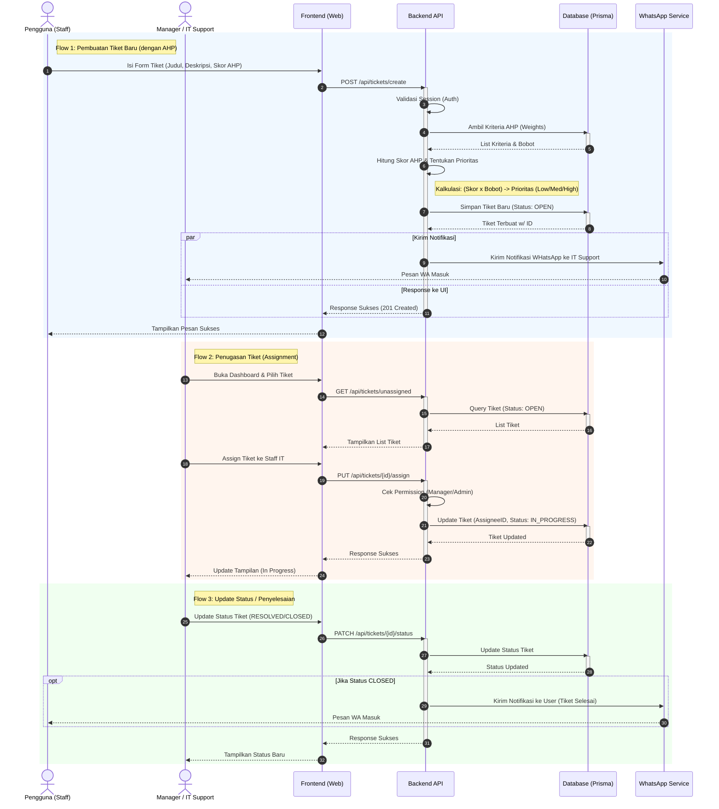

```mermaid
sequenceDiagram
    autonumber
    actor User as Pengguna (Staff)
    actor Manager as Manager / IT Support
    participant UI as Frontend (Web)
    participant API as Backend API
    participant DB as Database (Prisma)
    participant WA as WhatsApp Service

    %% FLOW 1: PEMBUATAN TIKET DENGAN AHP
    rect rgb(240, 248, 255)
    note right of User: Flow 1: Pembuatan Tiket Baru (dengan AHP)
    User->>UI: Isi Form Tiket (Judul, Deskripsi, Skor AHP)
    UI->>API: POST /api/tickets/create
    activate API
    API->>API: Validasi Session (Auth)
    
    %% AHP Logic
    API->>DB: Ambil Kriteria AHP (Weights)
    activate DB
    DB-->>API: List Kriteria & Bobot
    deactivate DB
    API->>API: Hitung Skor AHP & Tentukan Prioritas
    note right of API: Kalkulasi: (Skor x Bobot) -> Prioritas (Low/Med/High)

    API->>DB: Simpan Tiket Baru (Status: OPEN)
    activate DB
    DB-->>API: Tiket Terbuat w/ ID
    deactivate DB

    par Kirim Notifikasi
        API->>WA: Kirim Notifikasi WHatsApp ke IT Support
        WA-->>Manager: Pesan WA Masuk
    and Response ke UI
        API-->>UI: Response Sukses (201 Created)
    end
    deactivate API
    UI-->>User: Tampilkan Pesan Sukses
    end

    %% FLOW 2: PENUGASAN TIKET
    rect rgb(255, 245, 238)
    note right of Manager: Flow 2: Penugasan Tiket (Assignment)
    Manager->>UI: Buka Dashboard & Pilih Tiket
    UI->>API: GET /api/tickets/unassigned
    activate API
    API->>DB: Query Tiket (Status: OPEN)
    activate DB
    DB-->>API: List Tiket
    deactivate DB
    API-->>UI: Tampilkan List Tiket
    deactivate API

    Manager->>UI: Assign Tiket ke Staff IT
    UI->>API: PUT /api/tickets/{id}/assign
    activate API
    API->>API: Cek Permission (Manager/Admin)
    API->>DB: Update Tiket (AssigneeID, Status: IN_PROGRESS)
    activate DB
    DB-->>API: Tiket Updated
    deactivate DB
    API-->>UI: Response Sukses
    deactivate API
    UI-->>Manager: Update Tampilan (In Progress)
    end

    %% FLOW 3: PENYELESAIAN TIKET
    rect rgb(240, 255, 240)
    note right of Manager: Flow 3: Update Status / Penyelesaian
    Manager->>UI: Update Status Tiket (RESOLVED/CLOSED)
    UI->>API: PATCH /api/tickets/{id}/status
    activate API
    API->>DB: Update Status Tiket
    activate DB
    DB-->>API: Status Updated
    deactivate DB
    
    opt Jika Status CLOSED
        API->>WA: Kirim Notifikasi ke User (Tiket Selesai)
        WA-->>User: Pesan WA Masuk
    end

    API-->>UI: Response Sukses
    deactivate API
    UI-->>Manager: Tampilkan Status Baru
    end
```
