# Sequence Diagrams (Simple ECB/Robustness Style)

Dokumen ini berisi **Sequence Diagram** versi simpel (menggunakan gaya Entity-Control-Boundary / ECB) yang dirancang untuk mempermudah pemahaman dan presentasi sidang skripsi. Model ini mengambil garis besar alur data sistem berdasarkan activity diagram yang Anda kirimkan dan diselaraskan **100% menggunakan nama tabel asli di database PostgreSQL (Prisma)** tanpa menggunakan singkatan nama alias yang membingungkan.

---

## 1. Sequence Diagram: Diskusi & Chat
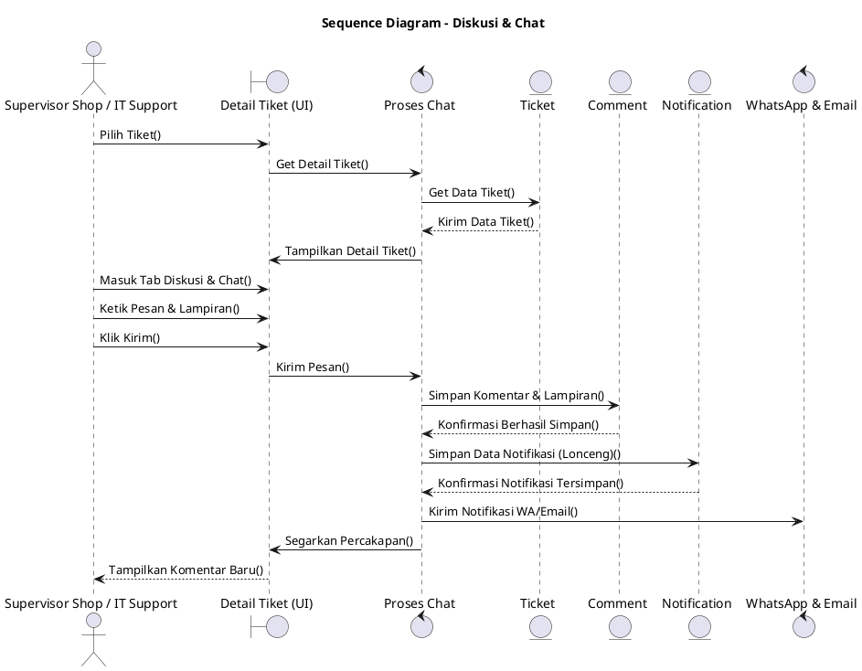

---

## 2. Sequence Diagram: Kelola Kriteria AHP (IT/Admin)
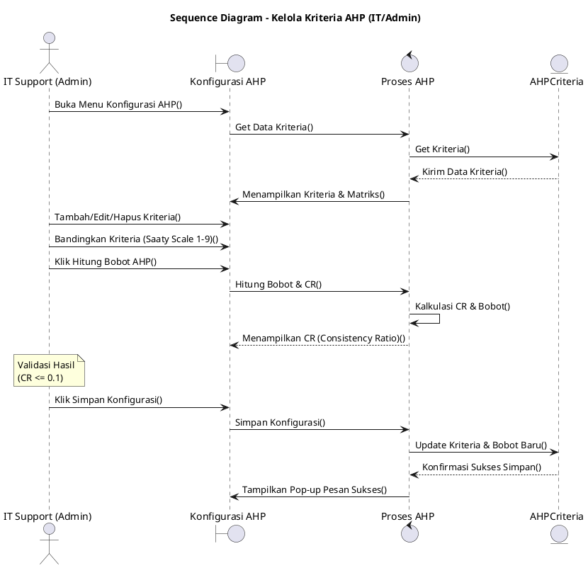

---

## 3. Sequence Diagram: Melihat Status Tiket
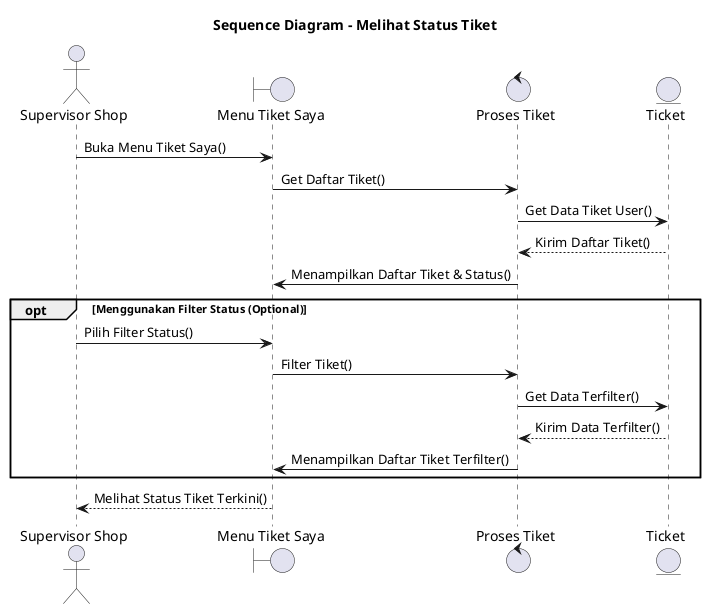

---

## 4. Sequence Diagram: Melihat Tiket yang Ditugaskan
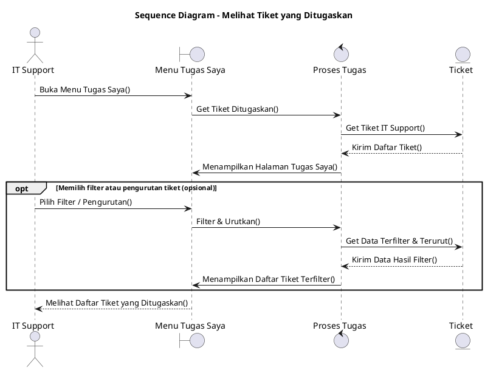

---

## 5. Sequence Diagram: Melihat Laporan Analitik
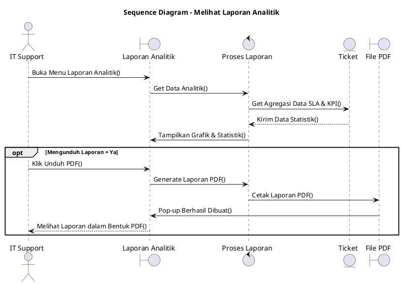

---

## 6. Sequence Diagram: Membaca Knowledge Base
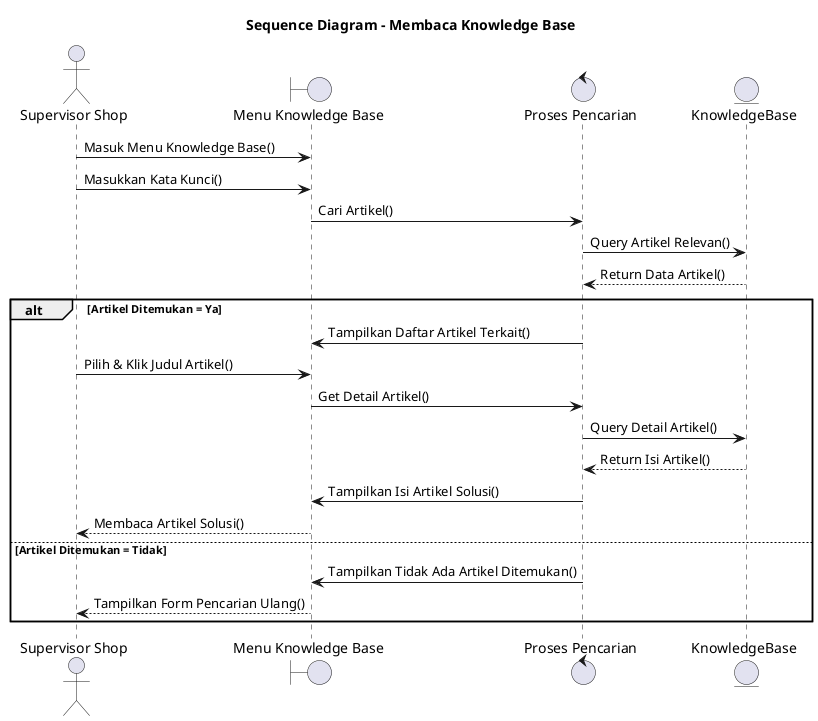

---

## 7. Sequence Diagram: Membuat Tiket
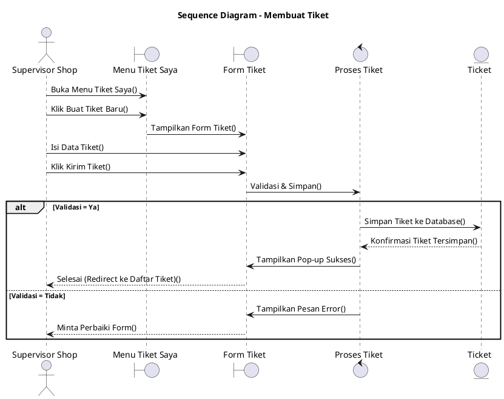

---

## 8. Sequence Diagram: Mengambil Tiket
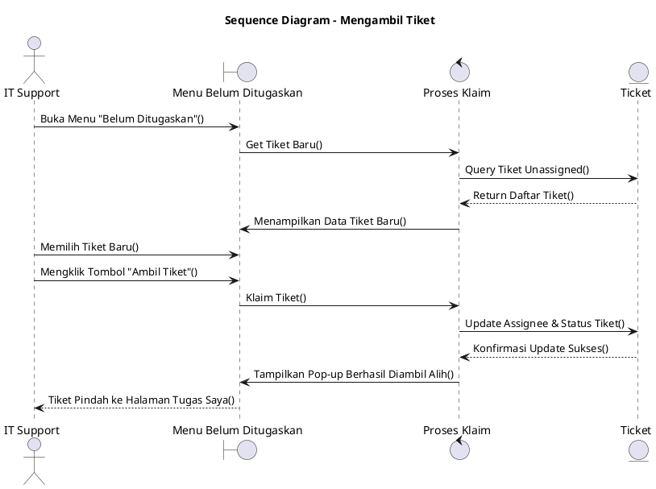

---

## 9. Sequence Diagram: Membuat Artikel Knowledge Base
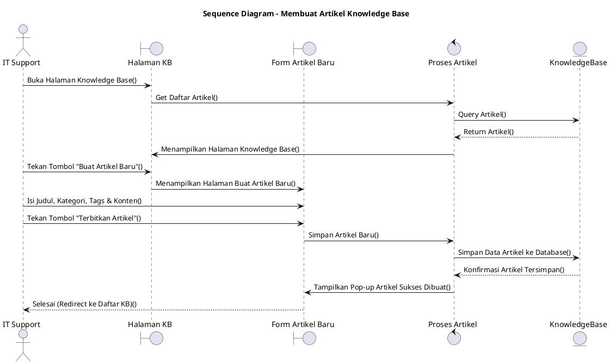

---

## 10. Sequence Diagram: Menerima Notifikasi
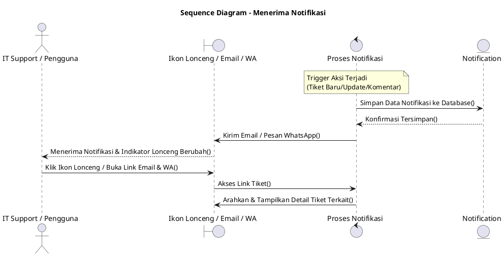

---

## 11. Sequence Diagram: Mengelola Pengguna
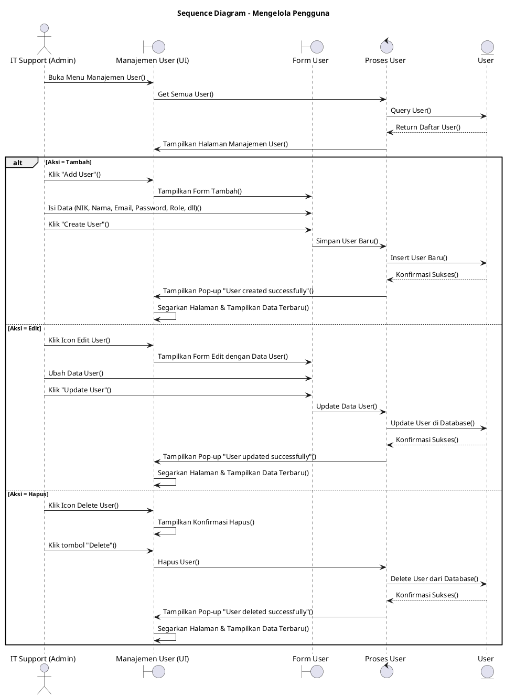

---

## 12. Sequence Diagram: Mengembalikan Tiket Dibatalkan (Restore)
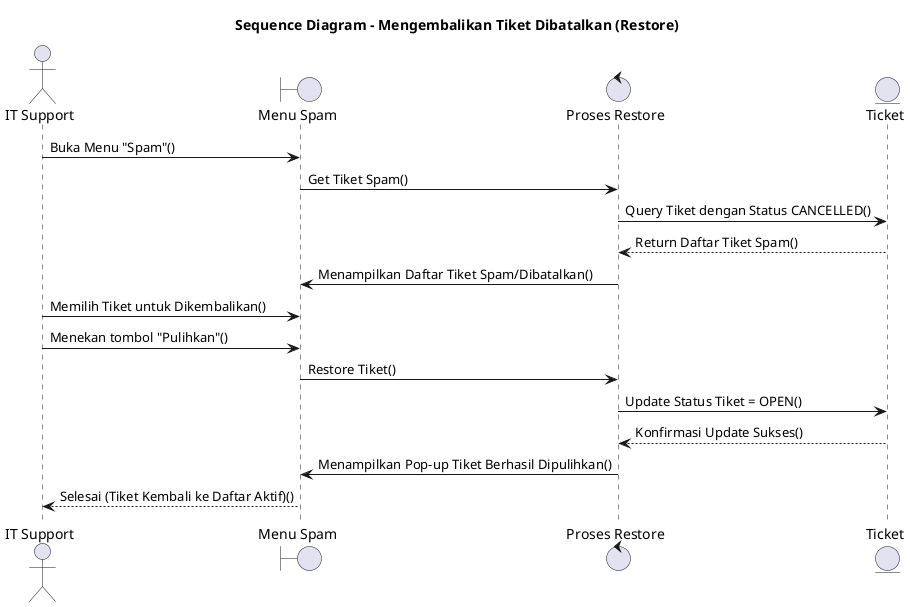

---

## 13. Sequence Diagram: Mengubah Status Tiket
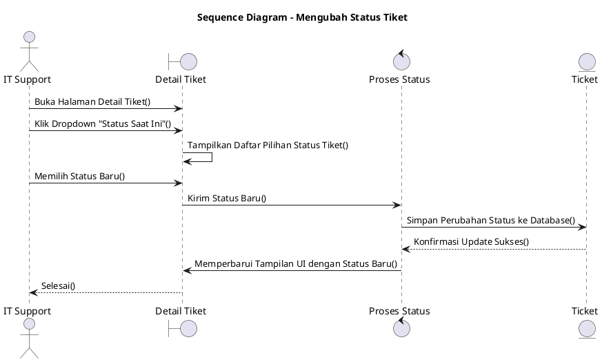

---

## 14. Sequence Diagram: Login
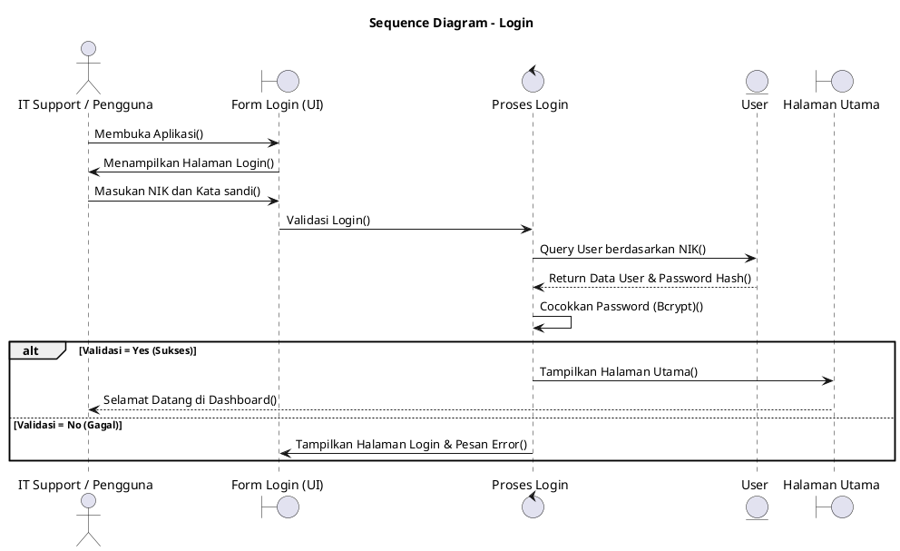
