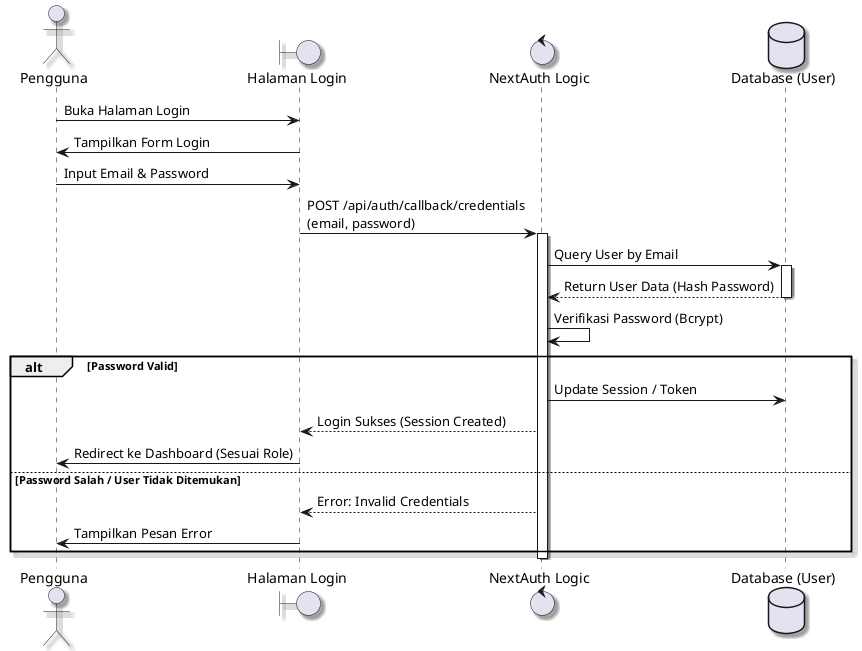
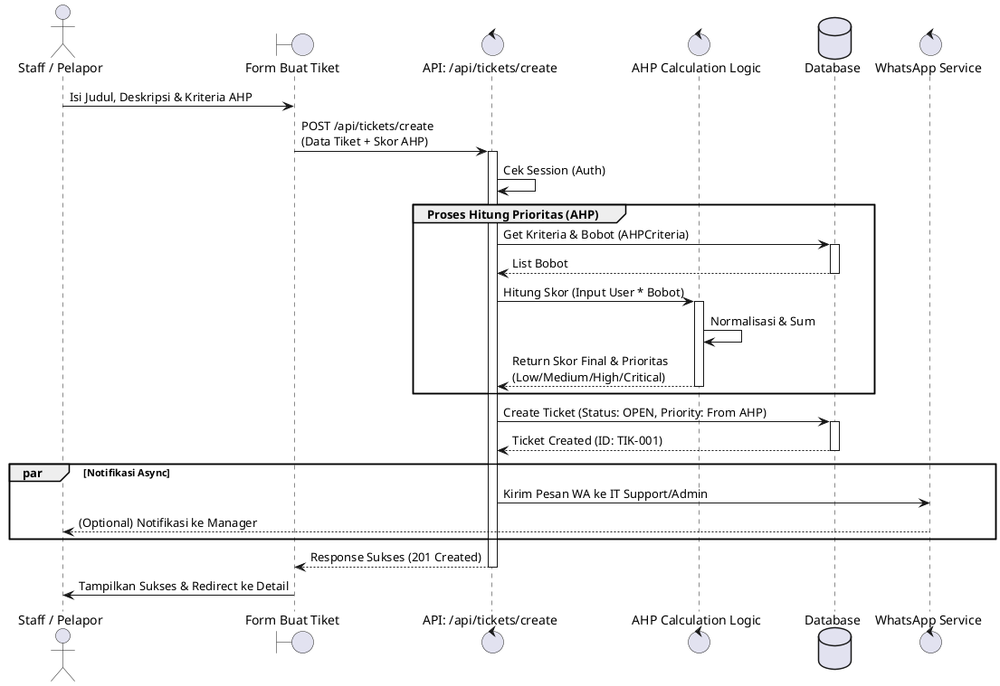
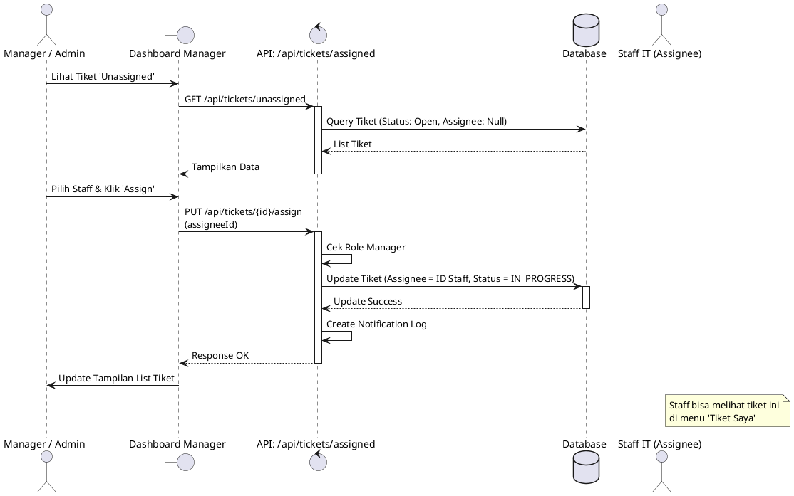
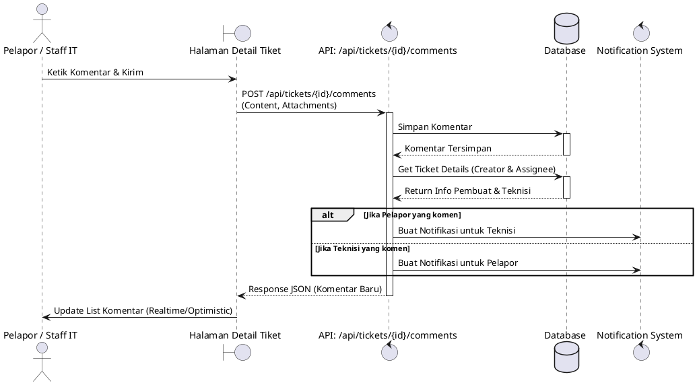
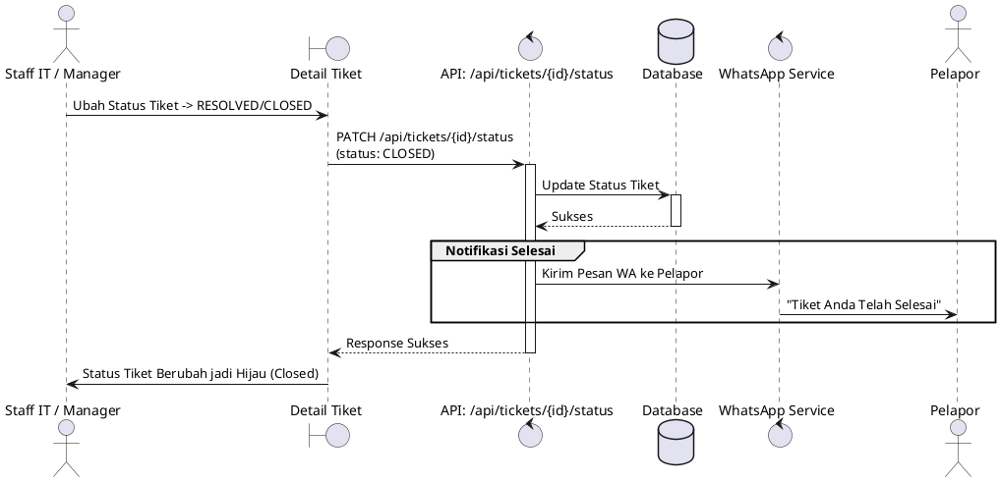
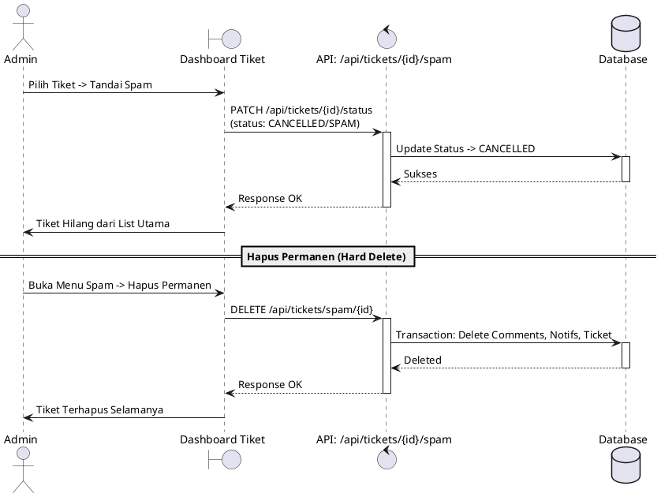

# Sequence Diagrams (PlantUML)

Salin kode di dalam blok code di bawah ini ke editor PlantUML (seperti PlantText atau IntelliJ IDEA Plugin).

## 1. Login & Autentikasi (Auth Modul)
Diagram ini menjelaskan proses login pengguna menggunakan kredensial (Email/Password) dan validasi role.

## 2. Pembuatan Tiket dengan AHP (Create Ticket)
Diagram ini menjelaskan alur pembuatan tiket dimana sistem otomatis menghitung prioritas menggunakan metode AHP.

## 3. Penugasan Tiket (Ticket Assignment)
Diagram ini menjelaskan bagaimana Manager atau Admin menugaskan tiket kepada Staff IT.

## 4. Diskusi & Komentar (Comment Flow)
Diagram ini menjelaskan interaksi komentar antara Pelapor dan IT Support.

## 5. Penyelesaian Tiket (Resolution Flow)
Diagram ini menjelaskan penutupan tiket oleh Staff IT atau Manager.

## 6. Manajemen Spam (Spam Handling)
Diagram ini menjelaskan pemindahan tiket ke folder Spam atau penghapusan permanen.

