# Sequence Diagrams (PlantUML) - Sesuai Implementasi Sistem Aktual (API)

Berikut adalah 15 Sequence Diagram lengkap yang sudah di-scan & dicocokkan langsung dengan baris kode *backend* aktual (Next.js App Router API, Prisma, NextAuth) di sistem yang Anda gunakan saat ini:

## 1. Login (Autentikasi NextAuth)
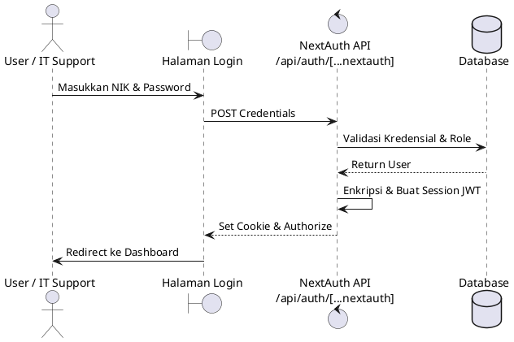

## 2. Logout
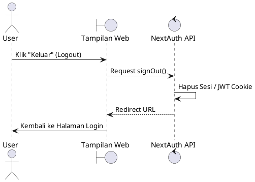

## 3. Pencarian Solusi Mandiri (Knowledge Base)
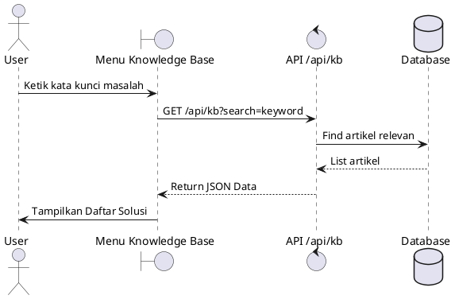

## 4. Create Ticket (Manual / Standard) 
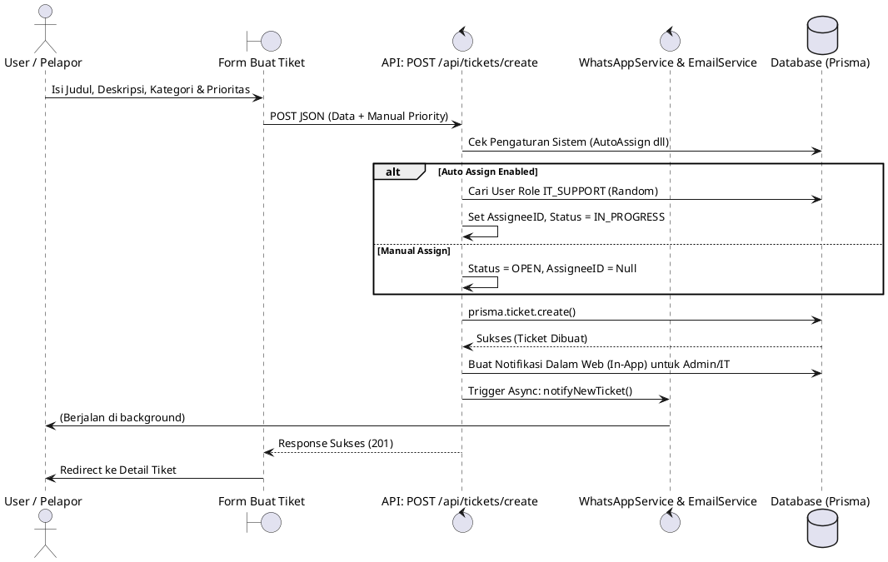

## 5. Create Ticket dengan AHP 
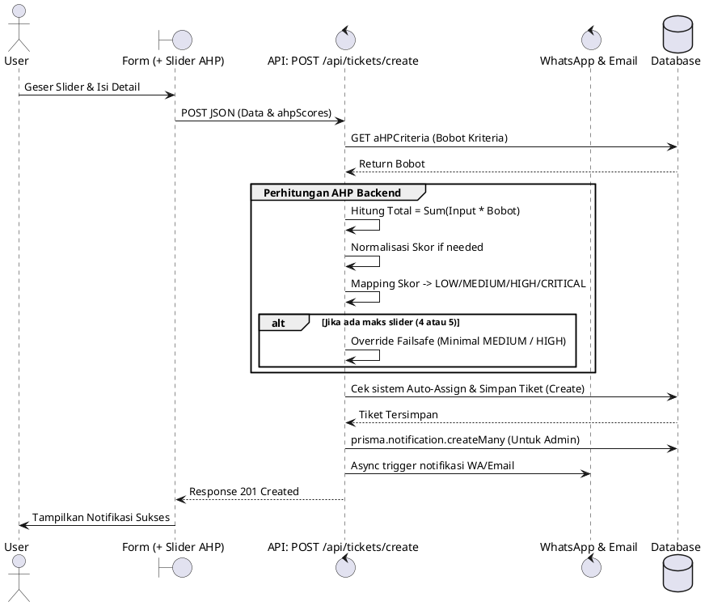

## 6. Tracking Status & History 
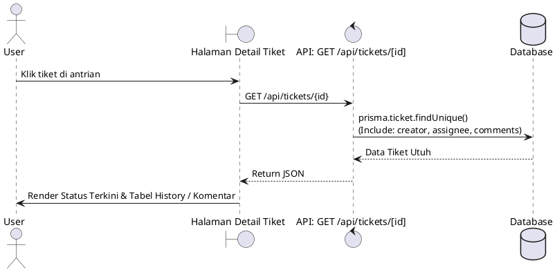

## 7. Komentar & Balasan (Diskusi)
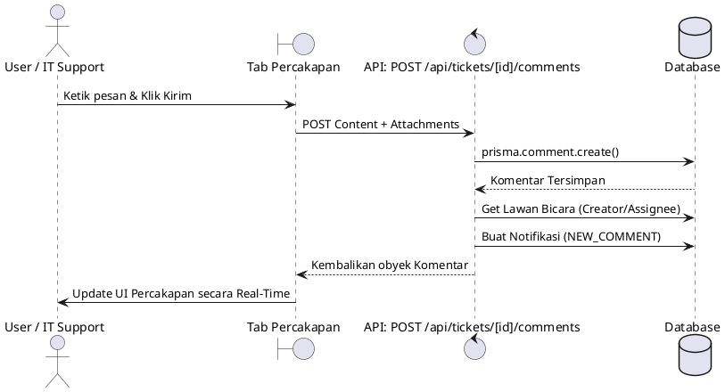

## 8. Upload Bukti
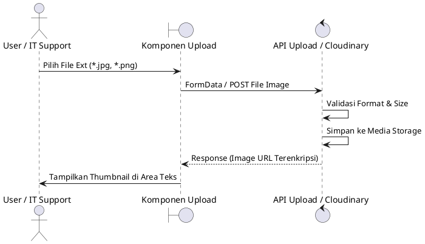

## 9. Claim Tiket (Self-Assignment IT Support)
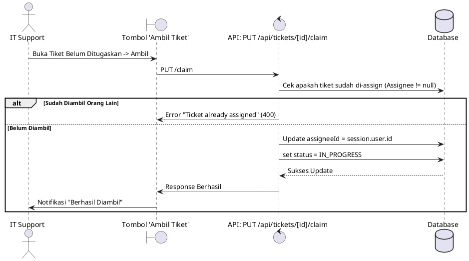

## 10. Update Progress & Log Aktivitas
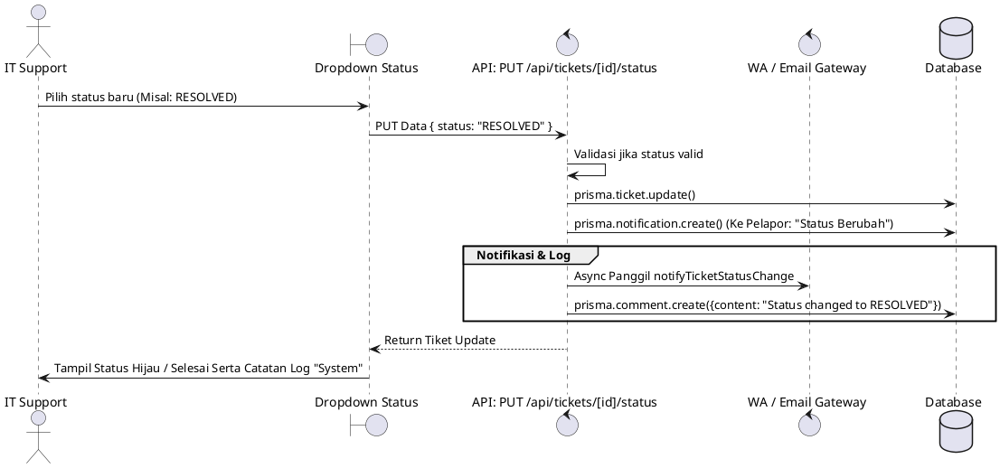

## 11. Notifikasi Automatis WA (Sistem)
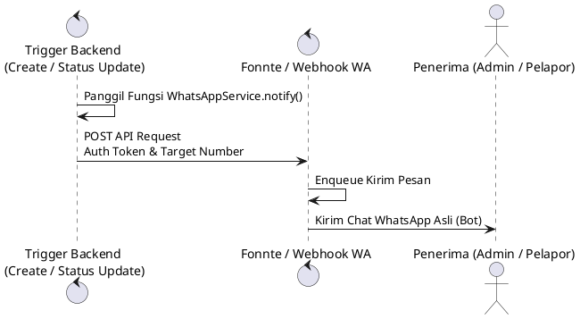

## 12. Pembatalan Tiket (Soft Delete)
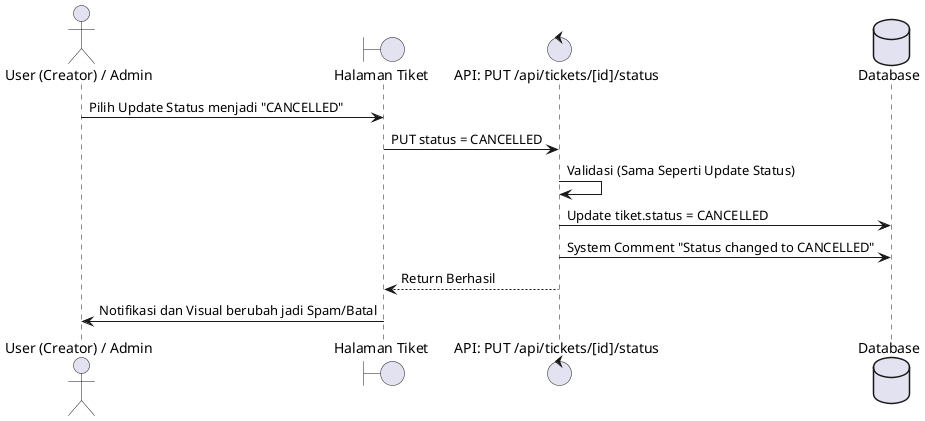

## 13. Restore Tiket (Kembalikan Dari Dibatalkan)
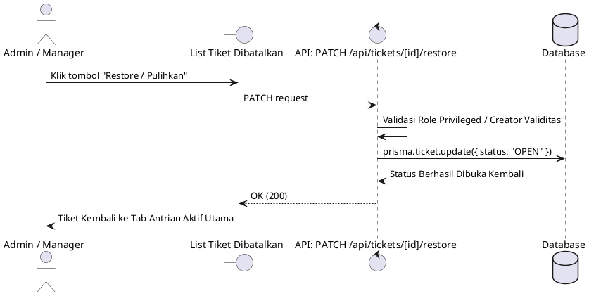

## 14. Hapus Permanen (Hard Delete Berantai)
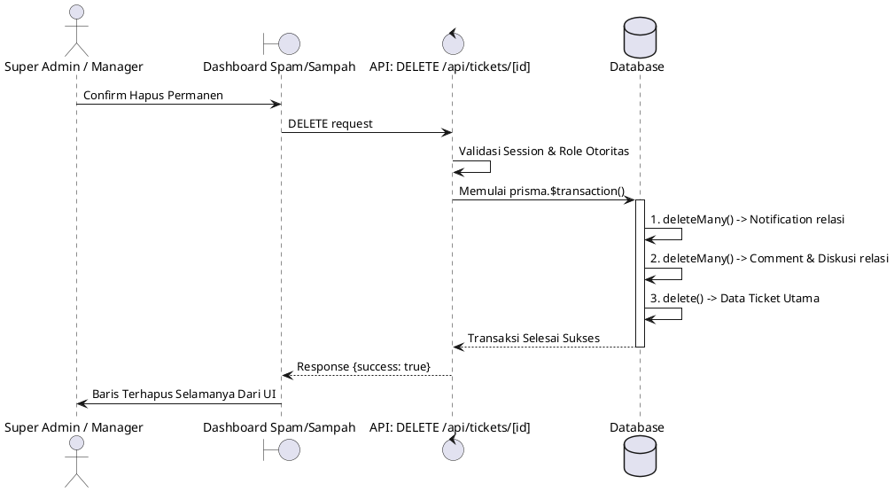

## 15. Membuat Artikel Knowledge Base
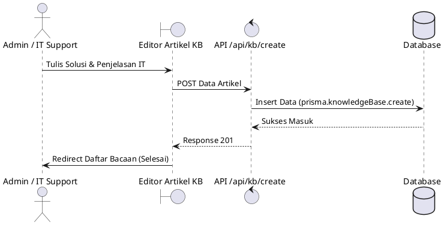
