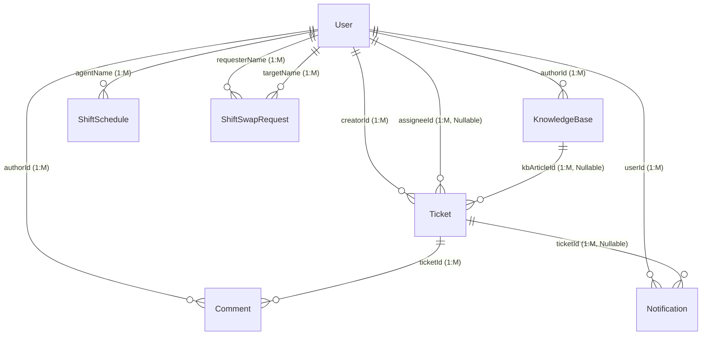

# Transformasi ERD ke LRS — IT Ticketing Support System

Dokumen ini berisi file XML draw.io untuk merepresentasikan **Transformasi Entity Relationship Diagram (ERD) ke Logical Record Structure (LRS)**. 

Setiap relasi **1-to-Many** ditransformasikan dengan memigrasikan Primary Key (PK) entitas sisi "1" menjadi Foreign Key (FK) di sisi "Many". Di diagram ini, migrasi kunci tersebut digambarkan di bawah diamond relasi, dan dibungkus menggunakan **kotak garis putus-putus (dashed box)** yang mengelilingi entitas penerima beserta diamond relasi yang melebur ke dalamnya.

---

## Cara Import ke draw.io

1. Buka **draw.io** (https://app.diagrams.net)
2. Buat diagram baru atau buka diagram kosong.
3. Pada menu atas, pilih **Extras → Edit Diagram** (atau **File → Import** jika menggunakan versi desktop).
4. **Hapus** semua teks yang ada di kotak input XML.
5. **Salin dan tempel (copy-paste)** seluruh isi kode XML di bawah ini.
6. Klik **OK** (atau **Apply**). Diagram transformasi ERD ke LRS akan terbentuk secara otomatis!

---

## XML draw.io (Salin Semua Kode di Bawah Ini)

```xml
<mxGraphModel dx="1422" dy="762" grid="1" gridSize="10" guides="1" tooltips="1" connect="1" arrows="1" fold="1" page="1" pageScale="1" pageWidth="1654" pageHeight="1169" math="0" shadow="0">
  <root>
    <mxCell id="0" />
    <mxCell id="1" parent="0" />

    <!-- ===== JUDUL DIAGRAM ===== -->
    <mxCell id="title" value="Transformasi ERD ke LRS — IT Ticketing Support System" style="text;html=1;strokeColor=none;fillColor=none;align=center;verticalAlign=middle;whiteSpace=wrap;rounded=0;fontSize=18;fontStyle=1;fontColor=#1a1a2e;" vertex="1" parent="1">
      <mxGeometry x="400" y="20" width="800" height="40" as="geometry" />
    </mxCell>

    <!-- ============================================================ -->
    <!-- DASHED BOXES (Grup Tabel Hasil Transformasi LRS) -->
    <!-- ============================================================ -->

    <!-- Dashed Box: User Table -->
    <mxCell id="box_user" value="Tabel: User (Pengguna)" style="rounded=0;whiteSpace=wrap;html=1;fillColor=none;strokeColor=#0288d1;strokeWidth=1.5;dashed=1;dashPattern=4 4;align=left;verticalAlign=top;spacingLeft=10;spacingTop=5;fontColor=#01579b;fontSize=10;fontStyle=3;" vertex="1" parent="1">
      <mxGeometry x="30" y="280" width="220" height="280" as="geometry" />
    </mxCell>

    <!-- Dashed Box: Ticket Table -->
    <mxCell id="box_ticket" value="Tabel: Ticket (Penerima FK creatorId, assigneeId, kbArticleId)" style="rounded=0;whiteSpace=wrap;html=1;fillColor=none;strokeColor=#0288d1;strokeWidth=1.5;dashed=1;dashPattern=4 4;align=left;verticalAlign=top;spacingLeft=10;spacingTop=5;fontColor=#01579b;fontSize=10;fontStyle=3;" vertex="1" parent="1">
      <mxGeometry x="310" y="190" width="510" height="390" as="geometry" />
    </mxCell>

    <!-- Dashed Box: Comment Table -->
    <mxCell id="box_comment" value="Tabel: Comment (Penerima FK ticketId, authorId)" style="rounded=0;whiteSpace=wrap;html=1;fillColor=none;strokeColor=#2e7d32;strokeWidth=1.5;dashed=1;dashPattern=4 4;align=left;verticalAlign=top;spacingLeft=10;spacingTop=5;fontColor=#1b5e20;fontSize=10;fontStyle=3;" vertex="1" parent="1">
      <mxGeometry x="210" y="610" width="470" height="310" as="geometry" />
    </mxCell>

    <!-- Dashed Box: KnowledgeBase Table -->
    <mxCell id="box_kb" value="Tabel: KnowledgeBase (Penerima FK authorId)" style="rounded=0;whiteSpace=wrap;html=1;fillColor=none;strokeColor=#2e7d32;strokeWidth=1.5;dashed=1;dashPattern=4 4;align=left;verticalAlign=top;spacingLeft=10;spacingTop=5;fontColor=#1b5e20;fontSize=10;fontStyle=3;" vertex="1" parent="1">
      <mxGeometry x="340" y="5" width="480" height="180" as="geometry" />
    </mxCell>

    <!-- Dashed Box: Notification Table -->
    <mxCell id="box_notif" value="Tabel: Notification (Penerima FK userId, ticketId)" style="rounded=0;whiteSpace=wrap;html=1;fillColor=none;strokeColor=#2e7d32;strokeWidth=1.5;dashed=1;dashPattern=4 4;align=left;verticalAlign=top;spacingLeft=10;spacingTop=5;fontColor=#1b5e20;fontSize=10;fontStyle=3;" vertex="1" parent="1">
      <mxGeometry x="800" y="260" width="470" height="290" as="geometry" />
    </mxCell>

    <!-- Dashed Box: ShiftSchedule Table -->
    <mxCell id="box_schedule" value="Tabel: ShiftSchedule (Penerima FK agentName/nik)" style="rounded=0;whiteSpace=wrap;html=1;fillColor=none;strokeColor=#7b1fa2;strokeWidth=1.5;dashed=1;dashPattern=4 4;align=left;verticalAlign=top;spacingLeft=10;spacingTop=5;fontColor=#4a148c;fontSize=10;fontStyle=3;" vertex="1" parent="1">
      <mxGeometry x="250" y="940" width="300" height="290" as="geometry" />
    </mxCell>

    <!-- Dashed Box: ShiftSwapRequest Table -->
    <mxCell id="box_swap" value="Tabel: ShiftSwapRequest (Penerima FK requesterName, targetName)" style="rounded=0;whiteSpace=wrap;html=1;fillColor=none;strokeColor=#7b1fa2;strokeWidth=1.5;dashed=1;dashPattern=4 4;align=left;verticalAlign=top;spacingLeft=10;spacingTop=5;fontColor=#4a148c;fontSize=10;fontStyle=3;" vertex="1" parent="1">
      <mxGeometry x="20" y="730" width="300" height="610" as="geometry" />
    </mxCell>

    <!-- Dashed Box: AHPCriteria Table -->
    <mxCell id="box_ahp" value="Tabel: AHPCriteria" style="rounded=0;whiteSpace=wrap;html=1;fillColor=none;strokeColor=#7b1fa2;strokeWidth=1.5;dashed=1;dashPattern=4 4;align=left;verticalAlign=top;spacingLeft=10;spacingTop=5;fontColor=#4a148c;fontSize=10;fontStyle=3;" vertex="1" parent="1">
      <mxGeometry x="720" y="940" width="380" height="290" as="geometry" />
    </mxCell>


    <!-- ============================================================ -->
    <!-- ENTITAS (Solid Boxes) -->
    <!-- ============================================================ -->

    <!-- User -->
    <mxCell id="ent_user" value="&lt;b&gt;User (Pengguna)&lt;/b&gt;&lt;hr&gt;&lt;b&gt;id&lt;/b&gt; [PK]&lt;br&gt;&lt;b&gt;nik&lt;/b&gt; (Unique)&lt;br&gt;name&lt;br&gt;&lt;b&gt;email&lt;/b&gt; (Unique)&lt;br&gt;password&lt;br&gt;role (Enum)&lt;br&gt;department&lt;br&gt;location&lt;br&gt;image&lt;br&gt;failedLoginAttempts&lt;br&gt;lockedUntil&lt;br&gt;createdAt&lt;br&gt;updatedAt" style="rounded=0;whiteSpace=wrap;html=1;fillColor=#e1f5fe;strokeColor=#0288d1;fontColor=#01579b;align=left;verticalAlign=top;spacingLeft=10;spacingTop=5;fontSize=10;" vertex="1" parent="1">
      <mxGeometry x="50" y="300" width="180" height="240" as="geometry" />
    </mxCell>

    <!-- Ticket -->
    <mxCell id="ent_ticket" value="&lt;b&gt;Ticket (Tiket)&lt;/b&gt;&lt;hr&gt;&lt;b&gt;id&lt;/b&gt; [PK]&lt;br&gt;&lt;b&gt;ticketNumber&lt;/b&gt; (Unique)&lt;br&gt;title&lt;br&gt;description&lt;br&gt;status (Enum)&lt;br&gt;priority (Enum)&lt;br&gt;category&lt;br&gt;ahpScore&lt;br&gt;attachments (Array)&lt;br&gt;createdAt&lt;br&gt;updatedAt" style="rounded=0;whiteSpace=wrap;html=1;fillColor=#e1f5fe;strokeColor=#0288d1;fontColor=#01579b;align=left;verticalAlign=top;spacingLeft=10;spacingTop=5;fontSize=10;" vertex="1" parent="1">
      <mxGeometry x="600" y="300" width="200" height="250" as="geometry" />
    </mxCell>

    <!-- Comment -->
    <mxCell id="ent_comment" value="&lt;b&gt;Comment (Komentar)&lt;/b&gt;&lt;hr&gt;&lt;b&gt;id&lt;/b&gt; [PK]&lt;br&gt;content&lt;br&gt;attachments (Array)&lt;br&gt;createdAt" style="rounded=0;whiteSpace=wrap;html=1;fillColor=#e8f5e9;strokeColor=#2e7d32;fontColor=#1b5e20;align=left;verticalAlign=top;spacingLeft=10;spacingTop=5;fontSize=10;" vertex="1" parent="1">
      <mxGeometry x="350" y="770" width="180" height="130" as="geometry" />
    </mxCell>

    <!-- KnowledgeBase -->
    <mxCell id="ent_kb" value="&lt;b&gt;KnowledgeBase (Artikel)&lt;/b&gt;&lt;hr&gt;&lt;b&gt;id&lt;/b&gt; [PK]&lt;br&gt;title&lt;br&gt;content&lt;br&gt;category&lt;br&gt;tags&lt;br&gt;createdAt&lt;br&gt;updatedAt" style="rounded=0;whiteSpace=wrap;html=1;fillColor=#e8f5e9;strokeColor=#2e7d32;fontColor=#1b5e20;align=left;verticalAlign=top;spacingLeft=10;spacingTop=5;fontSize=10;" vertex="1" parent="1">
      <mxGeometry x="600" y="20" width="200" height="150" as="geometry" />
    </mxCell>

    <!-- Notification -->
    <mxCell id="ent_notif" value="&lt;b&gt;Notification (Notifikasi)&lt;/b&gt;&lt;hr&gt;&lt;b&gt;id&lt;/b&gt; [PK]&lt;br&gt;title&lt;br&gt;message&lt;br&gt;type&lt;br&gt;read (Boolean)&lt;br&gt;link&lt;br&gt;createdAt" style="rounded=0;whiteSpace=wrap;html=1;fillColor=#e8f5e9;strokeColor=#2e7d32;fontColor=#1b5e20;align=left;verticalAlign=top;spacingLeft=10;spacingTop=5;fontSize=10;" vertex="1" parent="1">
      <mxGeometry x="1050" y="300" width="200" height="180" as="geometry" />
    </mxCell>

    <!-- AHPCriteria -->
    <mxCell id="ent_ahp" value="&lt;b&gt;AHPCriteria (Kriteria)&lt;/b&gt;&lt;hr&gt;&lt;b&gt;id&lt;/b&gt; [PK]&lt;br&gt;name&lt;br&gt;weight&lt;br&gt;description&lt;br&gt;createdAt&lt;br&gt;updatedAt" style="rounded=0;whiteSpace=wrap;html=1;fillColor=#f3e5f5;strokeColor=#7b1fa2;fontColor=#4a148c;align=left;verticalAlign=top;spacingLeft=10;spacingTop=5;fontSize=10;" vertex="1" parent="1">
      <mxGeometry x="900" y="1070" width="180" height="140" as="geometry" />
    </mxCell>

    <!-- ShiftSchedule -->
    <mxCell id="ent_schedule" value="&lt;b&gt;ShiftSchedule (Jadwal Shift)&lt;/b&gt;&lt;hr&gt;&lt;b&gt;id&lt;/b&gt; [PK]&lt;br&gt;date&lt;br&gt;shift&lt;br&gt;createdAt&lt;br&gt;updatedAt" style="rounded=0;whiteSpace=wrap;html=1;fillColor=#f3e5f5;strokeColor=#7b1fa2;fontColor=#4a148c;align=left;verticalAlign=top;spacingLeft=10;spacingTop=5;fontSize=10;" vertex="1" parent="1">
      <mxGeometry x="350" y="1070" width="180" height="140" as="geometry" />
    </mxCell>

    <!-- ShiftSwapRequest -->
    <mxCell id="ent_swap" value="&lt;b&gt;ShiftSwapRequest (Tukar Shift)&lt;/b&gt;&lt;hr&gt;&lt;b&gt;id&lt;/b&gt; [PK]&lt;br&gt;requesterShift&lt;br&gt;requesterDate&lt;br&gt;targetShift&lt;br&gt;targetDate&lt;br&gt;reason&lt;br&gt;status&lt;br&gt;approvedBy&lt;br&gt;approvedAt&lt;br&gt;createdAt&lt;br&gt;updatedAt" style="rounded=0;whiteSpace=wrap;html=1;fillColor=#f3e5f5;strokeColor=#7b1fa2;fontColor=#4a148c;align=left;verticalAlign=top;spacingLeft=10;spacingTop=5;fontSize=10;" vertex="1" parent="1">
      <mxGeometry x="50" y="1070" width="200" height="250" as="geometry" />
    </mxCell>


    <!-- ============================================================ -->
    <!-- RELASI DIAMOND (Amber/Orange) & ATRIBUT MIGRASI KUNCI -->
    <!-- ============================================================ -->

    <!-- menyusun (User -> KB) -->
    <mxCell id="rel_menyusun" value="menyusun" style="rhombus;whiteSpace=wrap;html=1;fillColor=#fff8e1;strokeColor=#ff8f00;fontColor=#ff6f00;fontStyle=1;align=center;fontSize=10;" vertex="1" parent="1">
      <mxGeometry x="380" y="70" width="120" height="60" as="geometry" />
    </mxCell>
    <mxCell id="attr_menyusun" value="FK: authorId" style="text;html=1;strokeColor=none;fillColor=none;align=center;verticalAlign=middle;whiteSpace=wrap;rounded=0;fontSize=10;fontColor=#ff6f00;fontStyle=2;" vertex="1" parent="1">
      <mxGeometry x="380" y="130" width="120" height="20" as="geometry" />
    </mxCell>

    <!-- membuat (User -> Ticket) -->
    <mxCell id="rel_membuat" value="membuat" style="rhombus;whiteSpace=wrap;html=1;fillColor=#fff8e1;strokeColor=#ff8f00;fontColor=#ff6f00;fontStyle=1;align=center;fontSize=10;" vertex="1" parent="1">
      <mxGeometry x="350" y="280" width="120" height="60" as="geometry" />
    </mxCell>
    <mxCell id="attr_membuat" value="FK: creatorId" style="text;html=1;strokeColor=none;fillColor=none;align=center;verticalAlign=middle;whiteSpace=wrap;rounded=0;fontSize=10;fontColor=#ff6f00;fontStyle=2;" vertex="1" parent="1">
      <mxGeometry x="350" y="340" width="120" height="20" as="geometry" />
    </mxCell>

    <!-- ditugaskan (User -> Ticket) -->
    <mxCell id="rel_ditugaskan" value="ditugaskan" style="rhombus;whiteSpace=wrap;html=1;fillColor=#fff8e1;strokeColor=#ff8f00;fontColor=#ff6f00;fontStyle=1;align=center;fontSize=10;" vertex="1" parent="1">
      <mxGeometry x="350" y="390" width="120" height="60" as="geometry" />
    </mxCell>
    <mxCell id="attr_ditugaskan" value="FK: assigneeId" style="text;html=1;strokeColor=none;fillColor=none;align=center;verticalAlign=middle;whiteSpace=wrap;rounded=0;fontSize=10;fontColor=#ff6f00;fontStyle=2;" vertex="1" parent="1">
      <mxGeometry x="350" y="450" width="120" height="20" as="geometry" />
    </mxCell>

    <!-- referensi (KB -> Ticket) -->
    <mxCell id="rel_referensi" value="referensi" style="rhombus;whiteSpace=wrap;html=1;fillColor=#fff8e1;strokeColor=#ff8f00;fontColor=#ff6f00;fontStyle=1;align=center;fontSize=10;" vertex="1" parent="1">
      <mxGeometry x="640" y="210" width="120" height="60" as="geometry" />
    </mxCell>
    <mxCell id="attr_referensi" value="FK: kbArticleId" style="text;html=1;strokeColor=none;fillColor=none;align=center;verticalAlign=middle;whiteSpace=wrap;rounded=0;fontSize=10;fontColor=#ff6f00;fontStyle=2;" vertex="1" parent="1">
      <mxGeometry x="640" y="270" width="120" height="20" as="geometry" />
    </mxCell>

    <!-- menulis (User -> Comment) -->
    <mxCell id="rel_menulis" value="menulis" style="rhombus;whiteSpace=wrap;html=1;fillColor=#fff8e1;strokeColor=#ff8f00;fontColor=#ff6f00;fontStyle=1;align=center;fontSize=10;" vertex="1" parent="1">
      <mxGeometry x="240" y="660" width="120" height="60" as="geometry" />
    </mxCell>
    <mxCell id="attr_menulis" value="FK: authorId" style="text;html=1;strokeColor=none;fillColor=none;align=center;verticalAlign=middle;whiteSpace=wrap;rounded=0;fontSize=10;fontColor=#ff6f00;fontStyle=2;" vertex="1" parent="1">
      <mxGeometry x="240" y="720" width="120" height="20" as="geometry" />
    </mxCell>

    <!-- memiliki (Ticket -> Comment) -->
    <mxCell id="rel_memiliki" value="memiliki" style="rhombus;whiteSpace=wrap;html=1;fillColor=#fff8e1;strokeColor=#ff8f00;fontColor=#ff6f00;fontStyle=1;align=center;fontSize=10;" vertex="1" parent="1">
      <mxGeometry x="540" y="660" width="120" height="60" as="geometry" />
    </mxCell>
    <mxCell id="attr_memiliki" value="FK: ticketId" style="text;html=1;strokeColor=none;fillColor=none;align=center;verticalAlign=middle;whiteSpace=wrap;rounded=0;fontSize=10;fontColor=#ff6f00;fontStyle=2;" vertex="1" parent="1">
      <mxGeometry x="540" y="720" width="120" height="20" as="geometry" />
    </mxCell>

    <!-- menerima (User -> Notification) -->
    <mxCell id="rel_menerima" value="menerima" style="rhombus;whiteSpace=wrap;html=1;fillColor=#fff8e1;strokeColor=#ff8f00;fontColor=#ff6f00;fontStyle=1;align=center;fontSize=10;" vertex="1" parent="1">
      <mxGeometry x="830" y="470" width="120" height="60" as="geometry" />
    </mxCell>
    <mxCell id="attr_menerima" value="FK: userId" style="text;html=1;strokeColor=none;fillColor=none;align=center;verticalAlign=middle;whiteSpace=wrap;rounded=0;fontSize=10;fontColor=#ff6f00;fontStyle=2;" vertex="1" parent="1">
      <mxGeometry x="830" y="530" width="120" height="20" as="geometry" />
    </mxCell>

    <!-- memicu (Ticket -> Notification) -->
    <mxCell id="rel_memicu" value="memicu" style="rhombus;whiteSpace=wrap;html=1;fillColor=#fff8e1;strokeColor=#ff8f00;fontColor=#ff6f00;fontStyle=1;align=center;fontSize=10;" vertex="1" parent="1">
      <mxGeometry x="830" y="360" width="120" height="60" as="geometry" />
    </mxCell>
    <mxCell id="attr_memicu" value="FK: ticketId" style="text;html=1;strokeColor=none;fillColor=none;align=center;verticalAlign=middle;whiteSpace=wrap;rounded=0;fontSize=10;fontColor=#ff6f00;fontStyle=2;" vertex="1" parent="1">
      <mxGeometry x="830" y="420" width="120" height="20" as="geometry" />
    </mxCell>

    <!-- mengajukan (User -> ShiftSwapRequest) -->
    <mxCell id="rel_mengajukan" value="mengajukan" style="rhombus;whiteSpace=wrap;html=1;fillColor=#fff8e1;strokeColor=#ff8f00;fontColor=#ff6f00;fontStyle=1;align=center;fontSize=10;" vertex="1" parent="1">
      <mxGeometry x="50" y="770" width="120" height="60" as="geometry" />
    </mxCell>
    <mxCell id="attr_mengajukan" value="FK: requesterName" style="text;html=1;strokeColor=none;fillColor=none;align=center;verticalAlign=middle;whiteSpace=wrap;rounded=0;fontSize=10;fontColor=#ff6f00;fontStyle=2;" vertex="1" parent="1">
      <mxGeometry x="50" y="830" width="120" height="20" as="geometry" />
    </mxCell>

    <!-- ditargetkan (User -> ShiftSwapRequest) -->
    <mxCell id="rel_ditargetkan" value="ditargetkan" style="rhombus;whiteSpace=wrap;html=1;fillColor=#fff8e1;strokeColor=#ff8f00;fontColor=#ff6f00;fontStyle=1;align=center;fontSize=10;" vertex="1" parent="1">
      <mxGeometry x="170" y="770" width="120" height="60" as="geometry" />
    </mxCell>
    <mxCell id="attr_ditargetkan" value="FK: targetName" style="text;html=1;strokeColor=none;fillColor=none;align=center;verticalAlign=middle;whiteSpace=wrap;rounded=0;fontSize=10;fontColor=#ff6f00;fontStyle=2;" vertex="1" parent="1">
      <mxGeometry x="170" y="830" width="120" height="20" as="geometry" />
    </mxCell>

    <!-- memiliki_shift (User -> ShiftSchedule) -->
    <mxCell id="rel_memiliki_shift" value="memiliki_shift" style="rhombus;whiteSpace=wrap;html=1;fillColor=#fff8e1;strokeColor=#ff8f00;fontColor=#ff6f00;fontStyle=1;align=center;fontSize=10;" vertex="1" parent="1">
      <mxGeometry x="280" y="980" width="120" height="60" as="geometry" />
    </mxCell>
    <mxCell id="attr_memiliki_shift" value="FK: agentName" style="text;html=1;strokeColor=none;fillColor=none;align=center;verticalAlign=middle;whiteSpace=wrap;rounded=0;fontSize=10;fontColor=#ff6f00;fontStyle=2;" vertex="1" parent="1">
      <mxGeometry x="280" y="1040" width="120" height="20" as="geometry" />
    </mxCell>

    <!-- dinilai (Ticket -> AHPCriteria) -->
    <mxCell id="rel_dinilai" value="dinilai" style="rhombus;whiteSpace=wrap;html=1;fillColor=#fff8e1;strokeColor=#ff8f00;fontColor=#ff6f00;fontStyle=1;align=center;fontSize=10;" vertex="1" parent="1">
      <mxGeometry x="750" y="980" width="120" height="60" as="geometry" />
    </mxCell>
    <mxCell id="attr_dinilai" value="Logis: ahpScore" style="text;html=1;strokeColor=none;fillColor=none;align=center;verticalAlign=middle;whiteSpace=wrap;rounded=0;fontSize=10;fontColor=#ff6f00;fontStyle=2;" vertex="1" parent="1">
      <mxGeometry x="750" y="1040" width="120" height="20" as="geometry" />
    </mxCell>


    <!-- ============================================================ -->
    <!-- KONEKSI HUBUNGAN (EDGES) -->
    <!-- ============================================================ -->

    <!-- User - menyusun - KB -->
    <mxCell id="edge_user_menyusun" value="" style="endArrow=none;html=1;rounded=0;exitX=0.5;exitY=0;entryX=0;entryY=0.5;strokeWidth=1.5;edgeStyle=orthogonalEdgeStyle;" edge="1" source="ent_user" target="rel_menyusun" parent="1">
      <mxGeometry relative="1" as="geometry" />
    </mxCell>
    <mxCell id="edge_menyusun_kb" value="" style="endArrow=none;html=1;rounded=0;exitX=1;exitY=0.5;entryX=0;entryY=0.5;strokeWidth=1.5;" edge="1" source="rel_menyusun" target="ent_kb" parent="1">
      <mxGeometry relative="1" as="geometry" />
    </mxCell>

    <!-- User - membuat - Ticket -->
    <mxCell id="edge_user_membuat" value="" style="endArrow=none;html=1;rounded=0;exitX=1;exitY=0.15;entryX=0;entryY=0.5;strokeWidth=1.5;" edge="1" source="ent_user" target="rel_membuat" parent="1">
      <mxGeometry relative="1" as="geometry" />
    </mxCell>
    <mxCell id="edge_membuat_ticket" value="" style="endArrow=none;html=1;rounded=0;exitX=1;exitY=0.5;entryX=0;entryY=0.15;strokeWidth=1.5;" edge="1" source="rel_membuat" target="ent_ticket" parent="1">
      <mxGeometry relative="1" as="geometry" />
    </mxCell>

    <!-- User - ditugaskan - Ticket -->
    <mxCell id="edge_user_ditugaskan" value="" style="endArrow=none;html=1;rounded=0;exitX=1;exitY=0.45;entryX=0;entryY=0.5;strokeWidth=1.5;" edge="1" source="ent_user" target="rel_ditugaskan" parent="1">
      <mxGeometry relative="1" as="geometry" />
    </mxCell>
    <mxCell id="edge_ditugaskan_ticket" value="" style="endArrow=none;html=1;rounded=0;exitX=1;exitY=0.5;entryX=0;entryY=0.45;strokeWidth=1.5;" edge="1" source="rel_ditugaskan" target="ent_ticket" parent="1">
      <mxGeometry relative="1" as="geometry" />
    </mxCell>

    <!-- User - menulis - Comment -->
    <mxCell id="edge_user_menulis" value="" style="endArrow=none;html=1;rounded=0;exitX=0.75;exitY=1;entryX=0.5;entryY=0;strokeWidth=1.5;edgeStyle=orthogonalEdgeStyle;" edge="1" source="ent_user" target="rel_menulis" parent="1">
      <mxGeometry relative="1" as="geometry" />
    </mxCell>
    <mxCell id="edge_menulis_comment" value="" style="endArrow=none;html=1;rounded=0;exitX=0.5;exitY=1;entryX=0.25;entryY=0;strokeWidth=1.5;" edge="1" source="rel_menulis" target="ent_comment" parent="1">
      <mxGeometry relative="1" as="geometry" />
    </mxCell>

    <!-- Ticket - memiliki - Comment -->
    <mxCell id="edge_ticket_memiliki" value="" style="endArrow=none;html=1;rounded=0;exitX=0.25;exitY=1;entryX=0.5;entryY=0;strokeWidth=1.5;edgeStyle=orthogonalEdgeStyle;" edge="1" source="ent_ticket" target="rel_memiliki" parent="1">
      <mxGeometry relative="1" as="geometry" />
    </mxCell>
    <mxCell id="edge_memiliki_comment" value="" style="endArrow=none;html=1;rounded=0;exitX=0.5;exitY=1;entryX=0.75;entryY=0;strokeWidth=1.5;" edge="1" source="rel_memiliki" target="ent_comment" parent="1">
      <mxGeometry relative="1" as="geometry" />
    </mxCell>

    <!-- KB - referensi - Ticket -->
    <mxCell id="edge_kb_referensi" value="" style="endArrow=none;html=1;rounded=0;exitX=0.5;exitY=1;entryX=0.5;entryY=0;strokeWidth=1.5;" edge="1" source="ent_kb" target="rel_referensi" parent="1">
      <mxGeometry relative="1" as="geometry" />
    </mxCell>
    <mxCell id="edge_referensi_ticket" value="" style="endArrow=none;html=1;rounded=0;exitX=0.5;exitY=1;entryX=0.5;entryY=0;strokeWidth=1.5;" edge="1" source="rel_referensi" target="ent_ticket" parent="1">
      <mxGeometry relative="1" as="geometry" />
    </mxCell>

    <!-- User - menerima - Notification -->
    <mxCell id="edge_user_menerima" value="" style="endArrow=none;html=1;rounded=0;exitX=1;exitY=0.8;entryX=0.5;entryY=0;strokeWidth=1.5;edgeStyle=orthogonalEdgeStyle;" edge="1" source="ent_user" target="rel_menerima" parent="1">
      <mxGeometry relative="1" as="geometry">
        <Array as="points">
          <mxPoint x="240" y="492"/>
          <mxPoint x="240" y="460"/>
          <mxPoint x="890" y="460"/>
        </Array>
      </mxGeometry>
    </mxCell>
    <mxCell id="edge_menerima_notif" value="" style="endArrow=none;html=1;rounded=0;exitX=1;exitY=0.5;entryX=0;entryY=0.8;strokeWidth=1.5;edgeStyle=orthogonalEdgeStyle;" edge="1" source="rel_menerima" target="ent_notif" parent="1">
      <mxGeometry relative="1" as="geometry" />
    </mxCell>

    <!-- Ticket - memicu - Notification -->
    <mxCell id="edge_ticket_memicu" value="" style="endArrow=none;html=1;rounded=0;exitX=1;exitY=0.5;entryX=0;entryY=0.5;strokeWidth=1.5;edgeStyle=orthogonalEdgeStyle;" edge="1" source="ent_ticket" target="rel_memicu" parent="1">
      <mxGeometry relative="1" as="geometry" />
    </mxCell>
    <mxCell id="edge_memicu_notif" value="" style="endArrow=none;html=1;rounded=0;exitX=1;exitY=0.5;entryX=0;entryY=0.5;strokeWidth=1.5;" edge="1" source="rel_memicu" target="ent_notif" parent="1">
      <mxGeometry relative="1" as="geometry" />
    </mxCell>


    <!-- ============================================================ -->
    <!-- LABEL KARDINALITAS (TEXT) -->
    <!-- ============================================================ -->
    <mxCell id="lbl_u_menyusun" value="1" style="text;html=1;align=center;verticalAlign=middle;resizable=0;points=[];fontSize=12;fontStyle=1;fontColor=#01579b;" vertex="1" parent="1">
      <mxGeometry x="110" y="270" width="20" height="20" as="geometry" />
    </mxCell>
    <mxCell id="lbl_menyusun_kb" value="M" style="text;html=1;align=center;verticalAlign=middle;resizable=0;points=[];fontSize=12;fontStyle=1;fontColor=#1b5e20;" vertex="1" parent="1">
      <mxGeometry x="570" y="80" width="20" height="20" as="geometry" />
    </mxCell>

    <mxCell id="lbl_u_membuat" value="1" style="text;html=1;align=center;verticalAlign=middle;resizable=0;points=[];fontSize=12;fontStyle=1;fontColor=#01579b;" vertex="1" parent="1">
      <mxGeometry x="240" y="310" width="20" height="20" as="geometry" />
    </mxCell>
    <mxCell id="lbl_membuat_t" value="M" style="text;html=1;align=center;verticalAlign=middle;resizable=0;points=[];fontSize=12;fontStyle=1;fontColor=#01579b;" vertex="1" parent="1">
      <mxGeometry x="570" y="310" width="20" height="20" as="geometry" />
    </mxCell>

    <mxCell id="lbl_u_ditugaskan" value="1" style="text;html=1;align=center;verticalAlign=middle;resizable=0;points=[];fontSize=12;fontStyle=1;fontColor=#01579b;" vertex="1" parent="1">
      <mxGeometry x="240" y="380" width="20" height="20" as="geometry" />
    </mxCell>
    <mxCell id="lbl_ditugaskan_t" value="M" style="text;html=1;align=center;verticalAlign=middle;resizable=0;points=[];fontSize=12;fontStyle=1;fontColor=#01579b;" vertex="1" parent="1">
      <mxGeometry x="570" y="390" width="20" height="20" as="geometry" />
    </mxCell>

    <mxCell id="lbl_u_menulis" value="1" style="text;html=1;align=center;verticalAlign=middle;resizable=0;points=[];fontSize=12;fontStyle=1;fontColor=#01579b;" vertex="1" parent="1">
      <mxGeometry x="190" y="580" width="20" height="20" as="geometry" />
    </mxCell>
    <mxCell id="lbl_menulis_c" value="M" style="text;html=1;align=center;verticalAlign=middle;resizable=0;points=[];fontSize=12;fontStyle=1;fontColor=#1b5e20;" vertex="1" parent="1">
      <mxGeometry x="380" y="720" width="20" height="20" as="geometry" />
    </mxCell>

    <mxCell id="lbl_t_memiliki" value="1" style="text;html=1;align=center;verticalAlign=middle;resizable=0;points=[];fontSize=12;fontStyle=1;fontColor=#01579b;" vertex="1" parent="1">
      <mxGeometry x="590" y="580" width="20" height="20" as="geometry" />
    </mxCell>
    <mxCell id="lbl_memiliki_c" value="M" style="text;html=1;align=center;verticalAlign=middle;resizable=0;points=[];fontSize=12;fontStyle=1;fontColor=#1b5e20;" vertex="1" parent="1">
      <mxGeometry x="480" y="720" width="20" height="20" as="geometry" />
    </mxCell>

    <mxCell id="lbl_kb_referensi" value="1" style="text;html=1;align=center;verticalAlign=middle;resizable=0;points=[];fontSize=12;fontStyle=1;fontColor=#1b5e20;" vertex="1" parent="1">
      <mxGeometry x="710" y="190" width="20" height="20" as="geometry" />
    </mxCell>
    <mxCell id="lbl_referensi_t" value="M" style="text;html=1;align=center;verticalAlign=middle;resizable=0;points=[];fontSize=12;fontStyle=1;fontColor=#01579b;" vertex="1" parent="1">
      <mxGeometry x="710" y="270" width="20" height="20" as="geometry" />
    </mxCell>

  </root>
</mxGraphModel>
```

---

## Petunjuk Visual LRS

Ketika diubah secara utuh ke bentuk **LRS (Logical Record Structure)**, seluruh diagram di atas diubah menjadi susunan tabel-tabel terhubung (tanpa diamond relasi) sebagai berikut:


